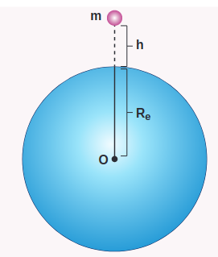
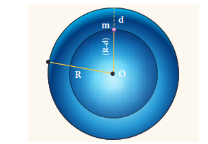
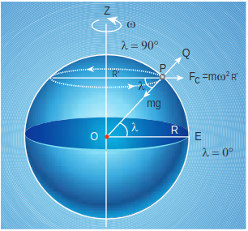

# 6.3 ACCELERATION DUE TO GRAVITY OF THE EARTH

When objects fall on the Earth, the
acceleration of the object is towards the
Earth. From Newton’s second law, an
object is accelerated only under the action
of a force. In the case of Earth, this force is
the gravitational pull of Earth. This force
produces a constant acceleration near the
Earth’s surface in all bodies, irrespective of
their masses. The gravitational force exerted
by Earth on the mass m near the surface of
the Earth is given by

Now equating Gravitational force to
Newton’s second law,

hence, acceleration is,

The acceleration experienced by the object
near the surface of the Earth due to its
gravity is called acceleration due to gravity.
It is denoted by the symbol g. The magnitude
of acceleration due to gravity is

It is to be noted that the acceleration
experienced by any object is independent
of its mass. The value of g depends only on
the mass and radius of the Earth. Infact,
Galileo arrived at the same conclusion 400
years ago that all objects fall towards the
Earth with the same acceleration through
various quantitative experiments. The
acceleration due to gravity g is found to be
9.8 m s−2 on the surface of the Earth near
the equator.

## 6.3.1 Variation of g with altitude, depth and latitude

Consider an object of mass m at a height h
from the surface of the Earth. Acceleration
experienced by the object due to Earth is

## Figure 6.17(a) Mass at a height h from the center of the Earth

If h Re We can use Binomial expansion. Taking the terms upto first order

We find that  g g . This means that as altitude h increases the acceleration due to gravity g decreases.

## EXAMPLE 6.7

1. Calculate the value of g in the following
two cases:
(a) If a mango of mass ½ kg falls from
a tree from a height of 15 meters,
what is the acceleration due to
gravity when it begins to fall?

## Solution

Consider a satellite orbiting the
Earth in a circular orbit of radius
1600 km above the surface of the
Earth. What is the acceleration
experienced by the satellite due to
Earth’s gravitational force?

## Solution

The above two examples show that the
acceleration due to gravity is a constant
near the surface of the Earth.
Can we substitute h = Re in
the equation 6.46? No. To get
equation 6.46 we assumed
that h << Re. However h =
Re can be substituted in equation 6.45

Variation of g with depth:
Consider a particle of mass m which is in
a deep mine on the Earth. (Example: coal
mines in Neyveli). Assume the depth of
the mine as d. To calculate ′g at a depth d,
consider the following points.

Figure 6.17(b) Particle in a mine
The part of the Earth which is above the
radius (R de − ) do not contribute to the
acceleration. The result is proved earlier and
is given as

Here M ’ is the mass of the Earth of radius
R de  
Assuming the density of Earth ρ to be
constant,

where M is the mass of the Earth and V its
volume, Thus,

Thus

Here also ′ <g g . As depth increases, ′g
decreases. It is very interesting to know that
acceleration due to gravity is maximum on
the surface of the Earth but decreases when
we go either upward or downward.

## Variation of g with latitude:
Whenever we analyze the motion of objects
in rotating frames [explained in chapter 3] we
must take into account the centrifugal force.
Even though we treat the Earth as an inertial
frame, it is not exactly correct because the
Earth spins about its own axis. So when
an object is on the surface of the Earth, it
experiences a centrifugal force that depends
on the latitude of the object on Earth. If the
Earth were not spinning, the force on the
object would have been mg. However, the
object experiences an additional centrifugal
force due to spinning of the Earth.

## Figure 6.18 Variation of g with latitude

This centrifugal force is given by m Rω2 ¢ .

where λ is the latitude. The component of
centrifugal acceleration experienced by the
object in the direction opposite to g is

Therefore,

From the expression (6.52), we can infer
that at equator,
  0;   g g R
2 . The
acceleration due to gravity is minimum. At
poles λ = °90 ;  g g, it is maximum. At the
equator,  g gis minimum.

## EXAMPLE 6.8
Find out the value of ′g in your school
laboratory?

## Solution
Calculate the latitude of the city or village
where the school is located. The information
is available in Google search. For example,
the latitude of Chennai is approximately 13
degree.

Here
ω2R = (2x3.14/86400)2 x (6400x103) =
3.4x10−2 m s−2.
It is to be noted that the value of λ
should be in radian and not in degree. 13
degree is equivalent to 0.2268 rad.

## Points to Contemplate
Suppose you move towards east-west
along the same latitude. Will the value
of ′g change?