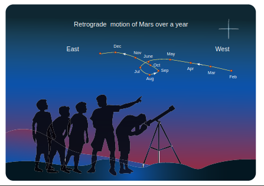
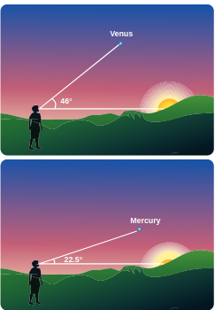
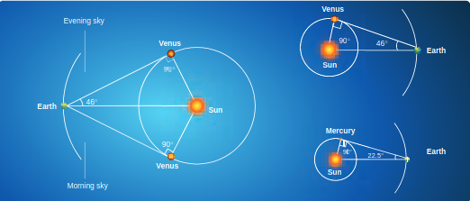
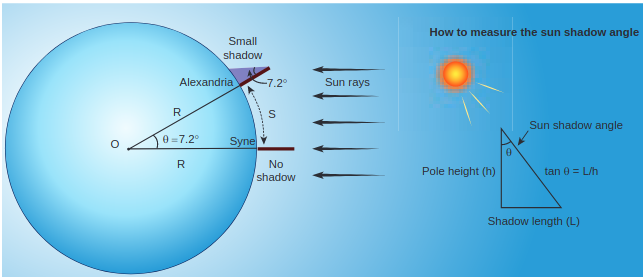
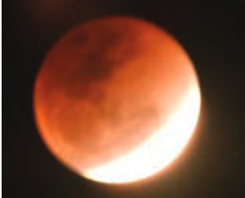
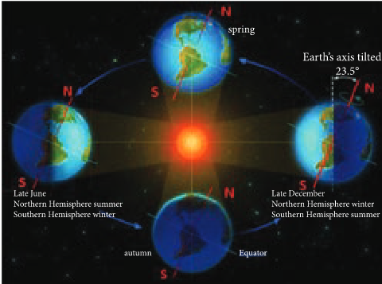
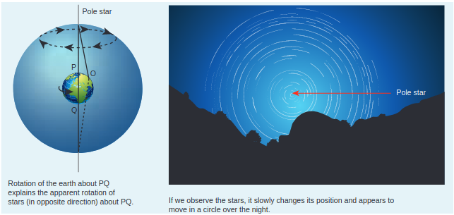
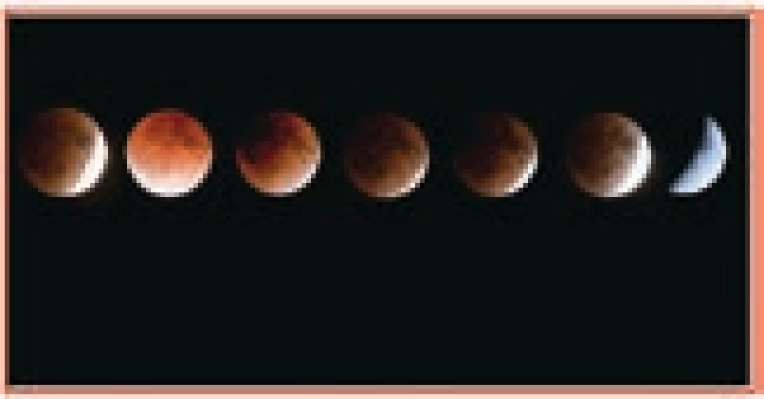

# 6.5 ELEMENTARY IDEAS OF ASTRONOMY

Astronomy is one of the oldest sciences in the history of mankind. In the olden days, astronomy was an inseparable part of physical science. It contributed a lot to the development of physics in the $16^{\text {th }}$ century. In fact Kepler's laws and Newton's theory of gravitation were formulated and verified using astronomical observations and data accumulated over the centuries by famous astronomers like Hippachrus, Aristachrus, Ptolemy, Copernicus and Tycho Brahe. Without Tycho Brahe's astronomical observations, Kepler's laws would not have emerged. Without Kepler's laws, Newton's theory of gravitation would not have been formulated.

It was mentioned in the beginning of this chapter that Ptolemy's geocentric model was replaced by Copernicus' heliocentric model. It is important to analyze and explain the shortcoming of the geocentric model over heliocentric model.

### 6.5.1 Heliocentric system over geocentric system

When the motion of the planets are observed in the night sky by naked eyes over a period of a few months, it can be seen that the planets move eastwards and reverse their motion for a while and return to eastward motion again. This is called "retrograde motion" of planets.

Figure 6.25 shows the retrograde motion of the planet Mars. Careful observation for a period of a year clearly shows that Mars initially moves eastwards (February to June), then reverses its path and moves backwards (July, August, September). It changes its direction of motion once again and continues its forward motion (October onwards). In olden days, astronomers recorded the retrograde motion of all

## Figure 6.25 Retrograde motion of planets

visible planets and tried to explain the
motion. According to Aristotle, the other
planets and the Sun move around the
Earth in the circular orbits. If it was really
a circular orbit it was not known how
the planet could reverse its motion for a
brief interval. To explain this retrograde
motion, Ptolemy introduced the concept
of “epicycle” in his geocentric model.
According to this theory, while the planet
orbited the Earth, it also underwent
another circular motion termed as
“epicycle”. A combination of epicycle and
circular motion around the Earth gave
rise to retrograde motion of the planets
with respect to Earth (Figure 6.26).
Essentially Ptolemy retained the Earth
centric idea of Aristotle and added the
epicycle motion to it.

 **Figure 6.26 “Epicycle” motion of planetary objects around Earth, depicted with respect to months of observation.**

 But Ptolemy’s model became more and
more complex as every planet was found
to undergo retrograde motion. In the 15th
century, the Polish astronomer Copernicus
proposed the heliocentric model to explain
this problem in a simpler manner. According
to this model, the Sun is at the center of
the solar system and all planets orbited the
Sun. The retrograde motion of planets with
respect to Earth is because of the relative
motion of the planet with respect to Earth.
The retrograde motion from the heliocentric
point of view is shown in Figure 6.27.
Figure 6.27 shows that the Earth orbits
around the Sun faster than Mars. Because
of the relative motion between Mars and
Earth, Mars appears to move backwards
from July to October. In the same way the
retrograde motion of all other planets was
explained successfully by the Copernicus
model. It was because of its simplicity, the
heliocentric model slowly replaced the
geocentric model. Historically, if any natural
phenomenon has one or more explanations,
the simplest one is usually accepted. Though
this was not the only reason to disqualify
the geocentric model, a detailed discussion

**Activity**

Students are encouraged to observe the
motion of the planet Mars by naked
eye and identify its retrograde motion.
As mentioned above, to observe the
retrograde motion six to seven months
are required. So students may start their
observation of Mars from the month of
June and continue till April next year.
Mars is the little bright planet with
reddish color. The position of the planet
Mars in the sky can be easily taken
from ‘Google’.

**Figure 6.27 ‘Retrograde motion’ in heliocentric model**

## 6.5.2 Kepler’s Third Law and The Astronomical Distance

When Kepler derived his three laws,
he strongly relied on Tycho Brahe’s
astronomical observation. In his third law,
he formulated the relation between the
distance of a planet from the Sun to the
time period of revolution of the planet.
Astronomers cleverly used geometry
and trigonometry to calculate the distance
of a planet from the Sun in terms of the
distance between Earth and Sun. Here we
can see how the distance of Mercury and
Venus from the Sun were measured. The
Venus and Mercury, being inner planets
with respect to Earth, the maximum
angular distance they can subtend at a
point on Earth with respect to the Sun is
46 degree for Venus and 22.5 degree for
Mercury. It is shown in the Figure 6.28

Figure 6.29 shows that when Venus is at
maximum elongation (i.e., 46 degree) with
respect to Earth, Venus makes 90 degree
to Sun. This allows us to find the distance
between Venus and Sun. The distance
between Earth and Sun is taken as one
Astronomical unit (1 AU).

**Figure 6.28 Angle of elevation for Venus and Mercury from horizon**

The trigonometric relation satisfied
by this right angled triangle is shown in
Figure 6.29.

where R = 1 AU.

**Figure 6.29 Angle of elevation for Mercury from horizon**

Here sin .46 0 72° = . Hence Venus is at a
distance of 0.72 AU from Sun. Similarly, the
distance between Mercury (θ is 22.5 degree)
and Sun is calculated as 0.38 AU. To find the
distance of exterior planets like Mars and
Jupiter, a slightly different method is used.
The distances of planets from the Sun is
given in the table below.

| Planet  | Semi-Major Axis (a) | Period T (days) | \( \frac{a^3}{T^2} \)  |
|---------|---------------------|------------------|------------------------|
| Mercury | 0.389 AU            | 87.77            | 7.64                   |
| Venus   | 0.724 AU            | 224.70           | 7.52                   |
| Earth   | 1.000 AU            | 365.25           | 7.50                   |
| Mars    | 1.524 AU            | 686.98           | 7.50                   |
| Jupiter | 5.200 AU            | 4332.62          | 7.49                   |
| Saturn  | 9.510 AU            | 10,759.20        | 7.40                   |

It is to be noted that to verify the Kepler’s
law we need only high school level geometry
and trigonometry.

**Activity**

Venus can be observed with the naked
eye. We can see Venus during sunrise
or sunset. Students are encouraged to
observe the motion of Venus and verify
that the maximum elevation is at 46 degree
and calculate the distance of Venus from
the Sun. As pointed out already Google or
Stellarium will be helpful in locating the
position of Venus in the sky.

## 6.5.3 Measurement of radius of the Earth
Around 225 B.C a Greek librarian
“Eratosthenes” who lived at Alexandria
measured the radius of the Earth with a
small error when compared with results
using modern measurements. The technique
he used involves lower school geometry and

**Figure 6.30 Measuring radius of The Earth**

brilliant insight. He observed that during
noon time of summer solstice the Sun’s rays
cast no shadow in the city Syne which was
located 500 miles away from Alexandria.
At the same day and same time he found
that in Alexandria the Sun’s rays made 7.2
degree with local vertical as shown in the
Figure 6.30. He realized that this difference
of 7.2 degree was due to the curvature of the
Earth.

The angle 7.2 degree is equivalent to 1/8 radian. So \( \theta = \frac{1}{8} \) rad;

If S is the length of the arc between the
cities of Syne and Alexandria, and if R is
radius of Earth, then
S R= =q 500miles,
so radius of the Earth

\( R = 500 \) miles

\[ R = \frac{500}{8} \] miles

R = 4000 miles

 mile is equal to 1.609 km. So, he measured
the radius of the Earth to be equal to R =
6436 km, which is amazingly close to the
correct value of 6378 km.
The distance of the Moon from Earth was
measured by a famous Greek astronomer
Hipparchus in the 3rd century BC.

**Activity**

To measure the radius of the Earth,
choose two different places (schools)
that are separated by at least 500 km. It is
important to note that these two places
have to be along the same longitude
of the Earth (For example Hosur and
Kanyakumari lie along the same longitude
of 77.82° E). Take poles of known length
(h) and fix them vertically in the ground
(it may be in the school playgrounds)
at both the places. At exactly noon in
both the places the length of the shadow
(L) cast by each pole has to be noted
down. Draw the picture like in Figure
6.30. By using the equation \[ \tan(\theta) = \frac{L}{h} \]
the angle in radian can be found at each
place. The difference in angle (
θ ′) is
due to the curvature of the Earth. Now
the distance between the two schools
can be obtained from ‘Google maps’.
Divide the distance with the angle (
θ ′ in radians) which will give the radius of the Earth.

## 6.5.4 Interesting Astronomical Facts
1. Lunar eclipse and measurement of
shadow of Earth
On January 31, 2018 there was a total
lunar eclipse which was observed from
various places including Tamil Nadu. It is
possible to measure the radius of shadow
of the Earth at the point where the Moon
crosses. Figure 6.31 illustrates this.
When the Moon is inside the umbra
shadow, it appears red in color. As soon
as the Moon exits from the umbra

**Figure 6.31 Total lunar eclipse**

shadow, it appears in crescent shape.
Figure 6.32 is the photograph taken by
digital camera during Moon’s exit from
the umbra shadow.

**Figure 6.32 Image of the Moon when it exits from umbra shadow**

By finding the apparent radii of the
Earth’s umbra shadow and the Moon, the
ratio of the these radii can be calculated.
This is shown in Figures 6.33 and 6.34.

**Figure 6.33 Schematic diagram of umbra disk radius**

The apparent radius of Earth’s umbra
shadow = Rs = 13.2 cm

The apparent radius of the Moon = Rm=
5.15 cm

The ratio \[ R = R_s \approx 2.56 \]

The radius of the Earth’s umbra shadow is \[R_s = 2.56 \times R_m \]

The radius of Moon Rm = 1737 km

**Figure 6.34 Calculation of umbra radius**

The radius of the Earth’s umbra shadow
is Rs = × ≅2 56 1737 4446. km kmRs = × ≅2 56 1737 4446. km km .

The correct radius is 4610 km.
The percentage of error in the calculation = 

The error will reduce if the pictures
taken using a high quality telescope
are used. It is to be noted that this
calculation is done using very simple
mathematics.
Early astronomers proved that Earth
is spherical in shape by looking at the
shape of the shadow cast by Earth on the
Moon during lunar eclipse.

**2. Why there are no lunar eclipse and
solar eclipse every month?**

If the orbits of the Moon and Earth lie on
the same plane, during full Moon of every
month, we can observe lunar eclipse.
If this is so during new Moon we can observe solar eclipse. But Moon’s orbit is
tilted 5° with respect to Earth’s orbit. Due
to this 5° tilt, only during certain periods
of the year, the Sun, Earth and Moon
align in straight line leading to either
lunar eclipse or solar eclipse depending
on the alignment. This is shown in
Figure 6.35

**3. Why do we have seasons on Earth?**

The common misconception is that
‘Earth revolves around the Sun, so when
the Earth is very far away, it is winter and
when the Earth is nearer, it is summer’.
Actually, the seasons in the Earth arise
due to the rotation of Earth around the
Sun with 23.5° tilt. This is shown in
Figure 6.36
Due to this 23.5° tilt, when the
northern part of Earth is farther to
the Sun, the southern part is nearer to
the Sun. So when it is summer in the
northern hemisphere, the southern
hemisphere experience winter.

**Figure 6.35 Orbital tilt of the Moon**

**Figure 6.36 Seasons on Earth**

**4. Star’s apparent motion and spinning
of the Earth**

The Earth’s spinning motion can be
proved by observing star’s position over
a night. Due to Earth’s spinning motion,
the stars in sky appear to move in circular
motion about the pole star as shown in
Figure 6.37

**Note**
Pole star is a star located
exactly above the Earth’s axis of
rotation, hence it appears to be
stationary. The Star Polaris is our pole star.

**Point to ponder**
Using Sun rays and shadows, How will
you prove that the Earth’s tilt is 23.5° ?

**Figure 6.37 Star’s apparent circular motion due to Earth’s rotation**

## 6.5.5 Recent developments of astronomy and gravitation

Till the 19th century astronomy mainly
depended upon either observation with
the naked eye or telescopic observation.
After the discovery of the electromagnetic
spectrum at the end of the 19th century, our
understanding of the universe increased
enormously. Because of this development
in the late 19th century it was found that
Newton’s law of gravitation could not
explain certain phenomena and showed
some discrepancies. Albert Einstein
formulated his ‘General theory of relativity’
which was one of the most successful
theories of 20th century in the field of
gravitation.

In the twentieth century both astronomy
and gravitation merged together and have
grown in manifold. The birth and death of stars
were more clearly understood. Many Indian
physicists made very important contributions
to the field of astrophysics and gravitation.

Subramanian Chandrasekar formulated
the theory of black holes and explained the
life of stars. These studies brought him the
Nobel prize in the year 1983. Another very
notable Indian astrophysicist Meghnad
Saha discovered the ionization formula
which was useful in classifying stars. This
formula is now known as “Saha ionization
formula”. In the field of gravitation Amal
Kumar Raychaudhuri solved an equation
now known as “Raychaudhuri equation”
which was a very important contribution.
Another notable Indian Astrophysicist
Jayant V Narlikar made pioneering
contribution in the field of astrophysics
and has written interesting books on
astronomy and astrophysics. IUCAA (Inter
University Center for Astronomy and
Astrophysics) is one of the important Indian
research institutes where active research in
astrophysics and gravitation are conducted.
The institute was founded by Prof. J.V.
Narlikar. Students are encouraged to read
more about the recent developments in these fields.

**SUMMARY**

The motion of planets can be explained using Kepler’s laws.
- **Kepler’s first law:** All the planets in the solar system orbit the Sun in elliptical orbits
with the Sun at one of the foci.
- **Kepler’s second law:** The radial vector line joining the Sun to a planet sweeps equal
areas in equal intervals of time.
- **Kepler’s third law:** The ratio of the square of the time period of planet to the cubic
power of semi major axis is constant for all the planets in the solar system.
- **Newton’s law of gravitation** states that the gravitational force between two masses
is directly proportional to product of masses and inversely proportional to square of the distance between the masses. In vector form it is given by 
F Gm m
r r= − 1 2
2
„ Gravitational force is a central force.
„ Kepler’s laws can be derived from Newton’s law of gravitation.
„ The gravitational field due to a mass m at a point which is at a distance r from mass
m is given by 
E Gm
r r= − 2 . It is a vector quantity.
„ The gravitational potential energy of two masses is given by U Gm m
r
  1 2 . It is a
scalar quantity.
„ The gravitational potential at a point which is at a distance r from mass m is given by V Gm
r
  . It is a scalar quantity.
„ The acceleration due to Earth’s gravity decreases as altitude increases and as depth
increases.
„ Due to rotation of the Earth, the acceleration due to gravity is maximum at poles
and minimum at Earth’s equator.
„ The (escape) speed of any object required to escape from the Earth’s gravitational
field is v gRe e= 2 . It is independent of mass of the object.
„ The energy of the satellite is negative. It implies that the satellite is bound to Earth’s
gravitational force.
„ Copernicus model explained that retrograde motion is due to relative motion
between planets. This explanation is simpler than Ptolemy’s epicycle explanation
which is complicated
„ Copernicus and Kepler measured the distance between a planet and the Sun using
simple geometry and trigonometry.
„ 2400 years ago, Eratosthenes measured the radius of the Earth using simple geometry
and trigonometry.

**I. Multiple Choice Questions**

1\. The linear momentum and position vector of the planet is perpendicular to each other at

 (a) perihelion and aphelion (b) at all points (c) only at perihelion (d) no point

**2\.** If the masses of the Earth and Sun suddenly double, the gravitational force between them will 

(a) remain the same (b) increase 2 times (c) increase 4 times (d) decrease 2 times

**3\.** A planet moving along an elliptical orbit is closest to the Sun at distance r1 and farthest away at a distance of r2. If v1 and v2 are linear speeds at these points respectively. Then the ratio v

_v_ 1

2

is

(NEET 2016)

(a) _r r_ 2

1

(b)  _r r_ 2

1

2 

 



 

(c)  _r r_

1

2

(d)  _r r_

1

2

2 

 



 

4\. The time period of a satellite orbiting Earth in a cirular orbit is independent of . (a) Radius of the orbit (b) The mass of the satellite (c) Both the mass and radius of the orbit  

**EVALUATION**

(d) Neither the mass nor the radius of its orbit

**5\.** If the distance between the Earth and Sun were to be doubled from its present value, the number of days in a year would be (a) 64.5 (b) 1032 (c) 182.5 (d) 730

**6\.** According to Kepler’s second law, the radial vector to a planet from the Sun sweeps out equal areas in equal intervals of time. This law is a consequence of (a) conservation of linear momentum (b) conservation of angular momentum (c) conservation of energy (d) conservation of kinetic energy

7\. The gravitational potential energy of the Moon with respect to Earth is (a) always positive (b) always negative (c) can be positive or negative (d) always zero

8\. The kinetic energies of a planet in an elliptical orbit about the Sun, at positions A, B and C are KA, KB and KC respectively. AC is the major axis and SB is perpendicular to AC at the position of the Sun S as shown in the figure. Then

(NEET 2018) (a) KA > KB >KC

(b) KB < KA <KC

(c) KA < KB <KC

(d) KB > KA >KC

S

B

A C

  

9\. The work done by the Sun’s gravitational force on the Earth is (a) always zero (b) always positive (c) can be positive or negative (d) always negative

**10\.** If the mass and radius of the Earth are both doubled, then the acceleration due to gravity g' (a) remains same (b) _g_

2 (c) 2 g (d) 4 g

**11\. The magnitude of the Sun’s gravitational** field as experienced by Earth is (a) same over the year (b) decreases in the month of January

and increases in the month of July (c) decreases in the month of July and

increases in the month of January (d) increases during day time and

decreases during night time. **12\.** If a person moves from Chennai to

Trichy, his weight (a) increases

(b) decreases

(c) remains same

(d) increases and then decreases **13\.** An object of mass 10 kg is hanging on

a spring scale which is attached to the roof of a lift. If the lift is in free fall, the reading in the spring scale is (a) 98 N (b) zero (c) 49 N (d) 9.8 N

**14\.** If the acceleration due to gravity becomes 4 times its original value, then escape speed (a) remains same (b) 2 times of original value  

(c) becomes halved (d) 4 times of original value

**15\. The kinetic energy of the satellite** orbiting around the Earth is (a) equal to potential energy (b) less than potential energy (c) greater than kinetic energy (d) zero

**Answers**

**1)** a **2)** c **3)** a **4)** b **5)** b **6)** b **7)** b **8)** a **9)** c **10)** b **11)** c **12)** b **13)** b **14)** b **15)** b

**II. Short Answer Questions**

**1\.** State Kepler’s three laws. **2\.** State Newton’s Universal law of

gravitation. **3\.** Will the angular momentum of a planet

be conserved? Justify your answer. 4. Define the gravitational field. Give its

unit. **5\.** What is meant by superposition of

gravitational field? 6. Define gravitational potential energy. **7\.** Is potential energy the property of a

single object? Justify. 8. Define gravitational potential. 9. What is the difference between

gravitational potential and gravitational potential energy?

**10\.** What is meant by escape speed in the case of the Earth?

**11\.** Why is the energy of a satellite (or any other planet) negative?

**12\.** What are geostationary and polar satellites?

13\. Define weight

  

**14\.** Why is there no lunar eclipse and solar eclipse every month?

**15\.** How will you prove that Earth itself is spinning?

**III. Long Answer Questions**

**1\.** Discuss the important features of the law of gravitation.

**2\.** Explain how Newton arrived at his law of gravitation from Kepler’s third law.

3\. Explain how Newton verified his law of gravitation.

**4\.** Derive the expression for gravitational potential energy.

**5\.** Prove that at points near the surface of the Earth, the gravitational potential energy of the object is _U mgh_\=

**6\.** Explain in detail the idea of weightlessness using lift as an example.

**7\.** Derive an expression for escape speed. **8\.** Explain the variation of g with lattitude. **9\.** Explain the variation of g with altitude. **10\.** Explain the variation of g with depth

from the Earth’s surface. **11\.** Derive the time period of satellite

orbiting the Earth. **12\.** Derive an expression for energy of

satellite. **13\.** Explain in detail the geostationary and

polar satellites. **14\.** Explain how geocentric theory is

replaced by heliocentric theory using the idea of retrograde motion of planets.

**15\.** Explain in detail the Eratosthenes method of finding the radius of Earth.  

**16\.** Describe the measurement of Earth’s shadow (umbra) radius during total lunar eclipse

**IV. Exercises**

**1\.** An unknown planet orbits the Sun with distance twice the semi major axis distance of the Earth’s orbit. If the Earth’s time period is T1, what is the time period of this unknown planet?

Ans: _T T_2 12 2=

**2\.** Assume that you are in another solar system and provided with the set of data given below consisting of the planets’ semi major axes and time periods. Can you infer the relation connecting semi major axis and time period?

| Planet (Imaginary) | Time Period (T) (years) | Semi-Major Axis (a) (AU) |
|--------------------|--------------------------|--------------------------|
| Kurinji            | 2                        | 8                        |
| Mullai             | 3                        | 18                       |
| Marutham           | 4                        | 32                       |
| Neithal            | 5                        | 50                       |
| Paalai             | 6                        | 72                       |

Planet (imaginary)

Time period(T) (in year)

Semi major axis (a)

(in AU) Kurinji 2 8 Mullai 3 18 Marutham 4 32 Neithal 5 50 Paalai 6 72

Ans: _a T_µ 2 2

**3\.** If the masses and mutual distance between the two objects are doubled, what is the change in the gravitational force between them?

Ans: No change

**4\.** Two bodies of masses m and 4m are placed at a distance r. Calculate the gravitational potential at a point on the line joining them where the gravitional field is zero.

Ans: _V Gm r_

\=− 9

  

**5\.** If the ratio of the orbital distance of

two planets d d

1

2

\=2, what is the ratio of

gravitational field experienced by these two planets?

Ans: E2 = 4 E1

6\. The Moon Io orbits Jupiter once in 1.769 days. The orbital radius of the Moon Io is 421700 km. Calculate the mass of Jupiter?

Ans: 1.898 ×1027 kg

**7\.** If the angular momentum of a planet is given by



L t tj ki= − +5 6 32 What is the torque experienced by the planet? Will the torque be in the same direction as that of the angular momentum?

Ans: τ= −10 6_ti j_

**8\.** Four particles, each of mass M and equidistant from each other, move along a circle of radius R under the action of their mutual gravitational attraction. Calculate the speed of each particle

Ans: 1 2

1 2 2_GM R_

+( ) **9\.** Suppose unknowingly you wrote the

universal gravitational constant value as G  6 67 1011. instead of the correct value G   6 67 10 11. , what is the acceleration due to gravity g’ for this incorrect G? According to this new acceleration due to gravity, what will be your weight W’?

Ans: g’ =1022 g, W’ = 1022W

10\. Calculate the gravitational field at point O due to three masses m1,m2 and m3 whose positions are given by the following figure. If the masses m1  

and m2 are equal what is the change in gravitational field at the point O?

m3

y

a

a

o x m1am2

Ans: 

_E G a_

_m m i m j_\= −( ) + 

 2 1 2 3

if m1 = m2, 

_E G a_

_m j_\= \[ \]2 3 

**11\.** What is the gravitational potential energy of the Earth and Sun? The Earth to Sun distance is around 150 million km. The mass of the Earth is 5.9 × 1024 kg and mass of the Sun is 1.9 × 1030 kg.

Ans: U= -49.84 × 1032 Joule

**12\.** Earth revolves around the Sun at 30 km s−1. Calculate the kinetic energy of the Earth. In the previous example you calculated the potential energy of the Earth. What is the total energy of the Earth in that case? Is the total energy positive? Give reasons.

Ans: K.E = 26.5 × 1032 J

E = −23.29 × 1032 J (−) ve implies that Earth is bounded with

Sun

**13\.** An object is thrown from Earth in such a way that it reaches a point at infinity with non-zero kinetic energy

  

K E r Mv.    

 

  1 2

2 , with what

velocity should the object be thrown from Earth?

Ans: _v v gRe E_\= +∞ 2 2

**14\.** Suppose we go 200 km above and below the surface of the Earth, what are the g values at these two points? In which case, is the value of g small?

Ans: gdown = 0.96 g gup = 0.94 g **15\.** Calculate the change in g value in

your district of Tamil nadu. (Hint: Get the latitude of your district of Tamil nadu from the Google). What is the difference in g values at Chennai and Kanyakumari?

Ans: gchennai = 9.7677 m s–2 gKanyakumari = 9.7667 m s–2 Δg = 0.001 m s–2

**V. Conceptual Questions**

**1\.** In the following, what are the quantities which that are conserved? a) Linear momentum of planet b) Angular momentum of planet c) Total energy of planet d) Potential energy of a planet

2\. The work done by Sun on Earth in one year will be a) Zero b) Non zero c) positive d) negative

3\. The work done by Sun on Earth at any finite interval of time is  

a) positive, negative or zero b) Strictly positive c) Strictly negative d) It is always zero

**4\.** If a comet suddenly hits the Moon and imparts energy which is more than the total energy of the Moon, what will happen?

**5\.** If the Earth’s pull on the Moon suddenly disappears, what will happen to the Moon?

**6\.** If the Earth has no tilt, what happens to the seasons of the Earth?

**7\.** A student was asked a question ‘why are there summer and winter for us? He replied as ‘since Earth is orbiting in an elliptical orbit, when the Earth is very far away from the Sun(aphelion) there will be winter, when the Earth is nearer to the Sun(perihelion) there will be winter’. Is this answer correct? If not, what is the correct explanation for the occurrence of summer and winter?

8\. The following photographs are taken from the recent lunar eclipse which occurred on January 31, 2018. Is it possible to prove that Earth is a sphere from these photographs?

  

**BOOKS FOR REFERENCE**

**1\.** Mechanics by Charles Kittel, Walter Kni Moyer

**2\.** Newtonian Mechanics by A.P. French

**3\.** Introduction to Mechanics by Daniel Kepl

**4\.** Mechanics by Somnath Datta

**5\.** Concepts of Physics volume 1 and Volume

**6\.** Physics for Scientist and Engineers with M

**7\.** Physics for Scientist and Engineers by Pau

**8\.** Physics for the Inquiring Mind by Eric Rog

**9\.** Fundamental laws of Mechanics by Irodov

**10\.** Question and Problems in School Physics  

**ICT CORNER**

**Gravitation**

  

**Gravit**

Through this activity you will be able to learn about the gravitational force and

orbital paths.

**STEPS:** • Click the URL or scan the QR code to launch

“Model” to start the activity.

• In the activity window, a diagram of sun and motion of earth.

• We can change the objects by selecting objects

• The path of the gravity, velocity and the obj relevant boxes given in the table.

  

  

**URL:** https://phet.colorado.edu/sims/html/gravity-and-orbit and-orbits\_en.html

\* Pictures are indicative only. \* If browser requires, allow **Flash Player** or **Java Scr**

**ICT CORNER**

**Step1**

**Step3**  

**ation**

the activity page. Click on the box labelled

earth is given. Click the play icon to see the

from the table given in the right side window.

ect in motion can be viewed. Check on the

s/latest/gravity-

**ipt** to load the page.

**Step4**

**Step2**

