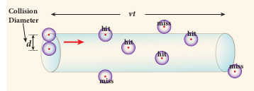

**MEAN FREE PATH**

Usually the average speed of gas molecules is several hundred meters per second even at room temperature (27°C). Odour from an open perfume bottle takes some time to reach us even if we are closer to the room. The time delay is because the odour of the molecules cannot travel straight to us as it undergoes a lot of collisions with the nearby air molecules and moves in a zigzag path. This average distance _travelled by the molecule between two successive collisions is called mean free path (_λ_). We can calculate the mean free path based on kinetic theory._

**Expression for mean free path** We know from postulates of kinetic theory that the molecules of a gas are in random motion and they collide with each other. Between two successive collisions, a molecule

  

moves along a straight path with uniform velocity. This path is called mean free path.

Consider a system of molecules each with diameter d. Let n be the number of molecules per unit volume.

Assume that only one molecule is in motion and all others are at rest as shown in the Figure 9.8

**hit**

**hit**

**hit**

**miss hit**

**_vt_**

**miss**

**miss**

**_d_**

**Collision Diameter**

**Figure 9.8** Mean free path

If a molecule moves with average speed _v_ in a time t, the distance travelled is _vt_. In this time t, consider the molecule to move in an imaginary cylinder of volume π_d_2_vt._ It collides with any molecule whose center is within this cylinder. Therefore, the number of collisions is equal to the number of molecules in the volume of the imaginary cylinder. It is equal to π_d_2_vtn._ The total path length divided by the number of collisions in time t is the mean free path.

Mean free path, λ = _distance travelled_

_Number of collisions_

λ π π

\= = _vt_

_n d vt n d_2 2

1 (9.25)

Though we have assumed that only one molecule is moving at a time and other molecules are at rest, in actual practice all the molecules are in random motion. So the average relative speed of one molecule with respect to other molecules has to be taken into account. After some detailed calculations (you will learn in higher classes) the correct expression for mean free path  

∴ =λ π

1 2 2_n d_ (9.26)

The equation (9.26) implies that the mean free path is inversely proportional to number density. When the number density increases the molecular collisions increases so it decreases the distance travelled by the molecule before collisions.

Case1: Rearranging the equation (9.26) using ‘m’ (mass of the molecule)

∴ =λ

π _m d mn_2 2

But mn=mass per unit volume = _ρ_ (density of the gas)

∴ =λ π ρ _m_

_d_2 2 (9.27)

Also we know that PV = NkT

P = =_N V kT nkT_

∴ =_n P_

_kT_

Substituting n= ∴ _P kT_

in equation (9.26), we get

λ π

\= _kT_

_d P_2 2 (9.28)

The equation (9.28) implies the following

1\. Mean free path increases with increasing temperature. As the temperature increases, the average speed of each molecule will increase. It is the reason why the smell of hot sizzling food reaches several meter away than smell of cold food.

2\. Mean free path increases with decreasing pressure of the gas and diameter of the gas molecules.

  

**9.6**

**EXAMPLE 9.6**

An oxygen molecule is travelling in air at 300 K and 1 atm, and the diameter of oxygen molecule is 1.2 × 10−10_m_. Calculate the mean free path of oxygen molecule.

**_Solution_**

From (9.26) λ π

\= 1

2 2_nd_ We have to find the number density n By using ideal gas law

_n N_

_V P kT_

\= = = × × ×−

101 3 10

1 381 10 300

3

23

.

.

\=2.449× 1025 _molecues_/_m_3

λ

π =

× × × × × −

1 2 2 449 10 1 2 1025 10 2. ( . )

\=

× 1

15 65 10 5

.

λ = 0.63 × 10−6_m_

