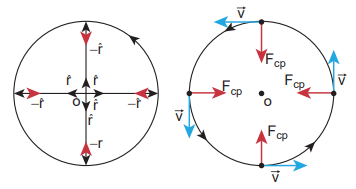

# DYNAMICS OF CIRCULAR MOTION

In the previous sections we have studied 
how to analyse linear motion using 
Newton’s laws. It is also important to know 
how to apply Newton’s laws to circular 
motion, since circular motion is one of 
the very common types of motion that we 
come across in our daily life. A particle 
can be in linear motion with or without 
any external force. But when circular 
motion occurs there must necessarily be 
some force acting on the object. There is 
no Newton’s first law for circular motion. 
In other words without a force, circular 
motion cannot occur in nature. A force 
can change the velocity of a particle in 
three different ways.

1. The magnitude of the velocity can be 
changed without changing the direction 
of the velocity. In this case the particle 
will move in the same direction but with 
acceleration. 

**Examples**

Particle falling down vertically, 
bike moving in a straight road with 
acceleration.

2. The direction of motion alone can be 
changed without changing the magnitude 
(speed). If this happens continuously 
then we call it ‘uniform circular motion’.

3. Both the direction and magnitude 
(speed) of velocity can be changed. If this 
happens non circular motion occurs. For 
example oscillation of a swing or simple 
pendulum, elliptical motion of planets 
around the Sun.

In this section we will deal with uniform 
circular motion and non-uniform circular 
motion.

## Centripetal force

If a particle is in uniform circular motion, 
there must be centripetal acceleration 
towards the centre of the circle. If there is 
acceleration then there must be some force 
acting on it with respect to an inertial frame. 
This force is called centripetal force. 

As we have seen in chapter 2, the 
centripetal acceleration of a particle in the 
circular motion is given by a
v
r =
2
 and it acts 
towards centre of the circle. According to 
Newton’s second law, the centripetal force is 
given by

The word Centripetal force means centre 
seeking force. 

In vector notation 

For uniform circular motion 2 ˆ cp F m    r r 

The direction –rˆ points towards the centre 
of the circle which is the direction of 
centripetal force as shown in Figure 3.38.

**Figure 3.38** Centripetal force

It should be noted that ‘centripetal force’ is 
not other forces like gravitational force or 
spring force. It can be said as ‘force towards 
centre’. The origin of the centripetal force 
can be gravitational force, tension in the 
string, frictional force, Coulomb force etc. 
Any of these forces can act as a centripetal 
force.

1. In the case of whirling motion of a stone 
tied to a string, the centripetal force 
on the particle is provided by the 
tensional force on the string. In circular 
motion in an amusement park, the 
centripetal force is provided by the 
tension in the iron ropes.

2. In motion of satellites around the Earth, 
the centripetal force is given by Earth’s 
gravitational force on the satellites. 
Newton’s second law for satellite motion is 

Where r- distance of the planet from the 
centre of the Earth.
