_“In nature, we have to deal not with material points but with material bodies ...–_ Max Planck

---
**Learning Objectives**

**In this unit, the student is exposed to** 
• relevance of the centre of mass in various system of particles 
• torque and angular momentum in rotational motion 
• types of equilibria with appropriate examples 
• moment of inertia of different rigid bodies 
• dynamics of rotation of rigid bodies 
• distinguishing translational motion from rotational motion
• rolling motion, slipping and sliding motions.

---
##INTRODUCTION

Most of the objects that we come across in our day to day life consist of large number of particles. In the previous Units, we studied the motion of bodies without considering their size and shape. So far we have treated even the bulk bodies as only point objects. In this section, we will give importance to the size and shape of the bodies. These bodies are actually made up of a large number of particles. When such a body moves, we consider it as the motion of collection of particles as a whole. We define the concept of centre of mass to deal with such a system of particles.

The forces acting on these bulk bodies are classified into internal and external _forces_. Internal forces are the forces acting among the particles within a system that constitute the body. External forces are the forces acting on the particles of a system from outside. In this unit, we deal with such system of particles which make different rigid bodies. A rigid body is the _one which maintains its definite and fixed shape even when an external force acts on it_. This means that, the interatomic distances do not change in a rigid body when an external force is applied. However, in real life situation, we have bodies which are not ideally rigid, because the shape and size of the body change when forces act on them. For the rigid bodies we study here, we assume that such deformations are negligible. The deformations produced on non-rigid bodies are studied separately in Unit 7 under elasticity of solids.

### CENTRE OF MASS

When a rigid body moves, all particles that constitute the body need not take the same path. Depending on the type of motion, different particles of the body may take different paths. For example, when a wheel rolls on a surface, the path of the centre point of the wheel and the paths of other points of the wheel are different. In this Unit, we study about the translation, rotation and the combination of these motions of rigid bodies in detail.

### Centre of Mass of a Rigid Body

When a bulk object (say a bat) is thrown at an angle in air as shown in Figure 5.1; do all the points of the body take a parabolic path? Actually, only one point takes the parabolic path and all the other points take different paths.
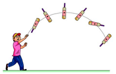
**Figure 5.1** Centre of mass tracing the path of a parabola

The one point that takes the parabolic path is a very special point called _centre of mass_ (CM) of the body. Its motion is like the motion of a single point that is thrown. The _centre of mass of a body is defined as a point where the entire mass of the body appears to be concentrated. Therefore, this point can_ represent the entire body.  

For bodies of regular shape and uniform mass distribution, the centre of mass is at the geometric centre of the body. As examples, for a circle and sphere, the centre of mass is at their centres; for square and rectangle, at the point their diagonals meet; for cube and cuboid, it is at the point where their body diagonals meet. For other bodies, the centre of mass has to be determined using some methods. The centre of mass could be well within the body and in some cases outside the body as well.

### Centre of Mass for Distributed Point Masses

_A point mass is a hypothetical point particle which has nonzero mass and no size or shape_. To find the centre of mass for a collection of n point masses, say, m1, m2, m3 . . . mn we have to first choose an origin and an appropriate coordinate system as shown in Figure 5.2. Let, x1, x2, x3 . . . xn be the X-coordinates of the positions of these point masses in the X direction from the origin.
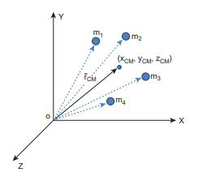
**Figure 5.2** Centre of mass for distributed point masses

The equation for the x coordinate of the centre of mass is,

x m x mCM

i i

i

  

where, Σmi is the total mass M of all the particles,   m Mi . Hence,

x m x MCM

i i  (5.1)

Similarly, we can also find y and z coordinates of the centre of mass for these distributed point masses as indicated in Figure (5.2).

y m y MCM

i i  (5.2)

z m z MCM

i i  (5.3)

Hence, the position of centre of mass of these point masses in a Cartesian coordinate system is (xCM, yCM, zCM). In general, the position of centre of mass can be written in a vector form as,

 

r m r MCM

i i= ∑ (5.4)

where,     CM CM CM CMr x i y j z ˆˆ ˆ k is the position vector of the centre of mass and 
i i i ir x i y k̂ˆ ĵ z    is the position vector of the distributed point mass; where, i, j ˆ ˆ and k̂ are the unit vectors along X, Y and Z-axes respectively.  

### Centre of Mass of Two Point Masses

With the equations for centre of mass, let us find the centre of mass of two point masses m1 and m2, which are at positions x1 and x2 respectively on the X-axis. For this case, we can express the position of centre of mass in the following three ways based on the choice of the coordinate system.

_(i) When the masses are on positive X-axis:_ The origin is taken arbitrarily so that the masses m1 and m2 are at positions x1 and x2 on the positive X-axis as shown in Figure 5.3(a). The centre of mass will also be on the positive X-axis at xCM as given by the equation,

x m x m x m mCM 

 

1 1 2 2

1 2

_(ii) When the origin coincides with any one of the masses:_ The calculation could be minimised if the origin of the coordinate system is made to coincide with any one of the masses as shown in Figure 5.3(b). When the origin coincides with the point mass m1, its position x1 is zero, (i.e. x1 = 0). Then,

x m m x

m mCM     

1 2 2

1 2

0

The equation further simplifies as,

x m x m mCM 

 2 2

1 2

_(iii) When the origin coincides with the centre of mass itself:_ If the origin of the coordinate system is made to coincide with the centre of mass,then, xCM = 0 and the mass m1 is found to be on the negative X-axis as shown in Figure 5.3(c). Hence, its position x1 is negative, (i.e. -x1).

The equation given above is known as _principle of moments._ We will learn more about this in Section 5.3.3.
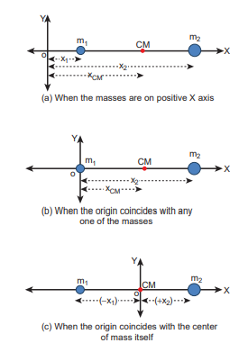
**Figure 5.3** Centre of mass of two point masses determined by shifting the origin
  

**EXAMPLE 5.1**

Two point masses 3 kg and 5 kg are at 4 m and 8 m from the origin on X-axis. Locate the position of centre of mass of the two point masses (i) from the origin and (ii) from 3 kg mass.

**_Solution_**

Let us take, m1 = 3 kg and m2= 5 kg

_(i) To find centre of mass from the origin:_ The point masses are at positions, x1 = 4 m, x2 = 8 m from the origin along X axis.

The centre of mass xCM can be obtained using equation 5.4.

x m x m x

m mCM = + +

1 1 2 2

1 2

xCM = ×( ) + ×( )

\+ 3 4 5 8

3 5

x mCM = + = =12 40 8

52 8

6 5.

The centre of mass is located 6.5 m from the origin on X-axis.

_(ii) To find the centre of mass from 3 kg mass:_ The origin is shifted to 3 kg mass along X-axis. The position of 3 kg point mass is zero (x1 = 0) and the position of 5 kg point mass is 4 m from the shifted origin (x2 = 4 m).

  
xCM = ×( ) + ×( )

\+ 3 0 5 4

3 5

x mCM = + = =0 20 8

20 8

2 5.

The centre of mass is located 2.5 m from 3 kg point mass, (and 1.5 m from the 5 kg point mass) on X-axis.

„ This result shows that the centre of mass is located closer to larger mass.

„ If the origin is shifted to the centre of mass, then the principle of moments holds good. m x m x1 1 2 2= ; 3 2 5 5 1 5  . . ; 7 5 7 5. .=

When we compare case (i) with case (ii), the x mCM = 2 5. from 3 kg mass could also be obtained by subtracting 4 m (the position of 3 kg mass) from 6.5 m, where the centre of mass was located in case (i)

**EXAMPLE 5.2**

From a uniform disc of radius R, a small disc of radius R2 is cut and removed as shown in the diagram. Find the centre of mass of the remaining portion of the disc.

**_Solution_**

Let us consider the mass of the uncut full disc be M. Its centre of mass would be at the geometric centre of the disc on which the origin coincides.
Let the mass of the small disc cut and removed be m and its centre of mass is at a position R 2 to the right of the origin as shown in the figure.  

Hence, the remaining portion of the disc should have its centre of mass to the left of the origin; say, at a distance x. We can write from the principle of moments,
M m x m R-( ) = ( ) 2 x m M m R= -( )     2 If s is the surface mass density (i.e. mass per unit surface area), s  M R 2 ; then, the mass m of small disc is, m surface mass density surfacearea= × m R          2 2 m M R R M R R M                   2 2 2 2 2 4 4 substituting m in the expression for x x M M M R M M R x R \= −      × =       × \= 4 4 

| 3 kg p5 kg p(ii), tapt |xxm |() ()30× +×54=35+02+ 0 20= == 25.8 8CMe o f m ass i s lo cated 2.5CMt m ass, (a nd 1.5 m ft mass) on X-axis. |
|------|------|------|------|
| m f rom rom t he |
| e cen troinoin |
| is r esult s hows t hat t he cen tre o f mass is located closer to larger mass. If  the  origin  is s hied  to t he  centre „of m ass, t hen t he p rinciple o f moments h olds g ood.  mx = mx ;„32 ..55  15 ; 75.. = 7511 22 |
| When w e co mpare c ase (i) w ith c ase he  xm = 25.  f rom 3 kg m ass could lso b e o btained b y s ubtracting 4  m (t he osition o f 3 kg m ass) f rom 6.5 m, w here he centre of mass was located in case (i)CM |

| ms=×urfacem  Mm   Rsubstitux = MRx =6 | R 2 ting m in tM2 |
|------|------|
| 4 |
| M |
| −4 |
  

The centre of mass of the remaining portion is at a distance R 6 to the left from the centre of the disc.

---
- If, the small disc is removed concentrically from the large disc, what will be the position of the centre of mass of the remaining portion of disc?

---
**EXAMPLE 5.3**

The position vectors of two point masses 10 kg and 5 kg are ˆˆˆ( 3 2 4 )_i j k_   m and

ˆˆˆ(3 6 5 )_i j k_  m respectively. Locate the position of centre of mass.

**_Solution_**
                1 2 1 2 1 1 2 2 1 2 10 5 ˆˆˆ( 3 2 4 ) ˆˆˆ(3 6 5 ) _m kg_ _m kg_ _r i j k m_ _r i j k m_ _m r m rr m m_   _r_        ˆ ˆˆ ˆˆ ˆ10( 3 2 4 ) 5(3 6 5 ) 10 5 _i j k i j k_ ˆ ˆˆ ˆˆ ˆ30 20 40 15 30 25 15 ˆˆˆ15 50 65 15 _i j k i j k_ _i j k_            _r_ \=       10 13 ˆˆˆ 3 3 _i j k m_
The centre of mass is located at position r .

xx  

### Centre of mass for uniform distribution of mass

If the mass is uniformly distributed in a bulk object, then a small mass (Dm) of the body can be treated as a point mass and the summations can be done to obtain the expressions for the coordinates of centre of mass.

On the other hand, if the small mass taken is infinitesimally\* small (dm) then, the summations can be replaced by integrations as given below.

**EXAMPLE 5.4**

Locate the centre of mass of a uniform rod of mass M and length .

**_Solution_**

Consider a uniform rod of mass M and length  whose one end coincides with the origin as shown in Figure. The rod is kept along the x axis. To find the centre of mass
x m x m y m y m z m z m CM i i i CM i i i CM i i i \= ( ) \= ( ) \= ( ) ∑ ∑ ∑ ∑ ∑ ∑ ∆ ∆ ∆ ∆ ∆ ∆ x x y y z z CM i i i CM i i i CM i i i ( ) ( ) ( ) x m x m y m y m z m z m CM i i i CM i i i CM i i i \= ( ) \= ( ) \= ( ) ∆ ∆ ∆ ∆ ∆ ∆ (5.5) x xdm dm y ydm dm z zdm dm cm cm cm          ; ; xdm dm y ydm dm z zdm dm cm cm cm          ; ; xd d y yd d z zd d cm cm cm          ; ; (5.6)
∗ Infinitesimal quantity is an extremely small quantity.

| e centre of mass of the remaining portion Ris at a distance   to the le from the centre 6of the disc. If, t he sm all di sc i s r emoved concentrically f rom t he l arge di sc, what w ill b e t he p osition o f t he „centre  of  mass o f  the  remaining portion of disc? |
|------|

| ggˆ 24ˆjk ˆ)ˆ 65ˆjk ˆ) m mrmm(3ijˆˆ 24ˆˆ kiˆˆ)5 (3 6511 2212 |jk ) |
|------|------|------|
| mk 10mk  5ri (31ri (32 mrr1 2 10r30r = e cent |

| 10  5ijˆˆ 20 ˆˆ40kiˆˆ 15 30 jk |25 |
| 1515ijˆ 50 ˆ  65 |kˆ |
| 15ijˆ 10 ˆ  13 kmˆ33re of mass is located at posi |tion r |

| EXAMPLE 5.3e p osition v ectors o f t wo p oint m asses 10 kg a nd 5 kg a re  (3ijˆ 24ˆ  kˆ)  m a nd (3ijˆ 65ˆ kˆ) m r espectively.   L ocate  the position of centre of mass.Solutionmk 10 gmk  5 gri (3 ˆ 24ˆjk ˆ)1ri (3ˆ 65ˆjk ˆ) m2 mr  mrr1 mm2 10(3ijˆˆ 24ˆˆ kiˆˆ)5 (3 65jk )r 11 2210  51230ijˆˆ 20 ˆˆ40kiˆˆ 15 30 jk 251515ijˆ 50 ˆ  65kˆ15r = ijˆ 1033ˆ  13 kmˆe centre of mass is located at position r . |
|------|

of this rod, we choose an infinitesimally small mass dm of elemental length dx at a distance x from the origin.

l is the linear mass density (i.e. mass

per unit length) of the rod. l = M 

The mass of small element (dm) is,

dm M dx= 

Now, we can write the centre of mass equation for this mass distribution as,

x xdm dmCM = ∫ ∫ x x M dx M xdxCM o o \=       \= ∫ ∫    1               1 2 1 2 2 0 2   x l xCM =  2 As the position  2

is the geometric centre of the rod, it is concluded that the centre of mass of the uniform rod is located at its geometric centre itself.

x

dx

o  

### Motion of Centre of Mass

When a rigid body moves, its centre of mass will also move along with the body. For kinematic quantities like velocity vCM  and acceleration aCM  of the centre of mass, we can differentiate the expression for position of centre of mass with respect to time once and twice respectively. For simplicity, let us take the motion along X direction only.

In the absence of external force, i.e. 

_Fext_ \= 0, the individual rigid bodies of a system can move or shift only due to the internal forces. This will not affect the position of the centre of mass. This means that the centre of mass will be in a state of rest or uniform motion. Hence, vCM will be zero when centre of mass is at rest and constant when centre of mass has uniform motion  v or v constantCM CM  0 . There will be no acceleration of centre of mass,

a CM =( )0 .     v dx dt m dx dt m m v mCM CM i i i i i i                  a d dt dx dt dv dt m dv dt m m CM CM CM i i i i \=     \=     \=     \= ∑ ∑ ∑ a m i i∑   a m a mCM i i i    (5.8)   v m v mCM i i i    (5.7) | ii(5.7)i dv   dt ii |
|------|
| m(5.8)i |

|  dxv v CM a CM= ddta CMCM |
|------|

| dxoxof t his r od, w e c hoose a n inni tesimally small m ass dm o f e lemental len gth dx a t a distance x from the origin. l  is t he lin ear m ass den sity (i .e. m ass Mper unit length) of the rod. l =e m ass o f sm all e lement (dm) i s, Mdm = dx ∫Now, w e c a∫n w rite t he cen tre o f m ass equation for this mass distribution as, ∫∫xdmx =dm M x  dx    1x CM = = xdxM 1  x  1    o     CM  2   2 o 2 l 2x =20As the position   is the geometric centre CM 2of t he r od, i t i s  concluded t hat t he cen tre of m ass of t he uniform rod i s lo cated  at its geometric centre itself. |
|------|

From equation (5.7) and 5.8,
  _v m v m_ _vCM i i_ _i CM_\= = =∑ ∑ 0 (or) constant It implies   _a m a mCM_ _i i_ _i_ \= =∑ ∑ 0 Here, the individual particles may still move with their respective velocities and accelerations due to internal forces.

In the presence of external force, (i.e. 

_F_ext ≠ 0 ), the centre of mass of the system will accelerate as given by the following equation.

    

 F m a F Ma a F

M ;ext i CM ext CM CM

ext= ( ) = =∑ ;

**EXAMPLE 5.5**

A man of mass 50 kg is standing at one end of a boat of mass 300 kg floating on still water. He walks towards the other end of the boat with a constant velocity of 2 m s-1 with respect to a stationary observer on land. What will be the velocity of the boat, (a) with respect to the stationary observer on land? (b) with respect to the man walking in the boat?

\[Given: There is friction between the man and the boat and no friction between the boat and water.\]

**_Solution_**

Mass of the man (m1) is, m1= 50 kg Mass of the boat (m2) is, m2 = 300 kg

With respect to a stationary observer: The man moves with a velocity, v1 =

2 m s-1 and the boat moves with a velocity v2 (which is to be found)

_(i) To determine the velocity of the boat with respect to a stationary observer on land:_ As there is no external force acting on the system, the man and boat move due to the friction, which is an internal force in the boat-man system. Hence, the velocity of the centre of mass is zero (vCM = 0).

Using equation 5.7,
0 1 1 2 2 1 2       m v m m v m v m m i i i 0 1 1 2 2 m v m v  m v m v2 2 1 1 v m m v2 1 2 1  v2 50 300 2 100 300     
The negative sign in the answer implies that the boat moves in a direction opposite to that of the walking man on the boat to a stationary observer on land.

_(ii) To determine the velocity of the boat with respect to the walking man:_ We can find the relative velocity as,

v v v21 2 1 

v m s2 10 33= − −.

| v ==It impaCM ==CM |
|------|
where, v21 is the relative velocity of the boat with respect to the walking man.

v21 0 33 2     .

v ms21 12 33  .

The negative sign in the answer implies that the boat appears to move in the opposite direction to the man walking in the boat.

„ The magnitude of the relative velocity of the boat with respect to the walking man is greater than the magnitude of the relative velocity of the boat with respect to the stationary observer.

„ The negative signs in the two answers indicate the opposite direction of the boat with respect to the stationary observer and the walking man on the boat.

_Centre of mass in explosions:_ Many a times rigid bodies are broken in to fragments. If an explosion is caused by the internal forces in a body which is at rest or in motion, the state of the centre of mass is not affected. It continues to be in the same state of rest or motion. But, the kinematic quantities of the fragments get affected. If the explosion is caused by an external agency, then the kinematic quantities of the centre of mass as well as the fragments get affected.

**EXAMPLE 5.6**

A projectile of mass 5 kg, in its course of motion explodes on its own into two fragments. One fragment of mass 3 kg falls at three fourth of the range R of the projectile. Where will the other fragment fall?  

**_Solution_**

It is an explosion of its own without any external influence. After the explosion, the centre of mass of the projectile will continue to complete the parabolic path even though the fragments are not following the same parabolic path. After the fragments have fallen on the ground, the centre of mass rests at a distance R (the range) from the point of projection as shown in the diagram.
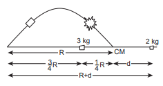

If the origin is fixed to the final position of the centre of mass, the principle of moments holds good.

m x m x1 1 2 2=

where, m1 = 3 kg, m2 = 2 kg, x1 = 1 4

R. The value of x2 = d

3 1 4

2  R d;

d R= 3 8

The distance between the point of launching and the position of 2 kg mass is R+d.

R d R R R R     3 8

11 8

1 375.

The other fragment falls at a distance of 1.375R from the point of launching. (Here R is the range of the projectile.)
| where, v  is the relative velocity of the boat with respect to 
the walking m an.v  03. 32 21vm  23. 3 se negative sign in the answer implies that 21the b oat a ppears t o m ove in t he o pposite 1direction t o t21 he m an wa lking in t he boat.e m agnitude o f t he r elativevelocity o f t he b oat w ith r espect t othe wa lking m an i s g reater t han t he„magnitude of t he r elative v elocity o fthe boat with respect to the stationar yobserver.e n egative sig ns in t he t wo answers in dicate t he  opposite direction o f t he b oat w ith r espect „to  the s tationar y o bser ver a nd  the walking man on the boat. |
|------|
rFsin   

## TORQUE AND ANGULAR MOMENTUM

When a net force acts on a body, it produces linear motion in the direction of the applied force. If the body is fixed to a point or an axis, such a force rotates the body depending on the point of application of the force on the body. This ability of the force to produce rotational motion in a body is called torque or moment of force. Examples for such motion are plenty in day to day life. To mention a few; the opening and closing of a door about the hinges and turning of a nut using a wrench.

The extent of the rotation depends on the magnitude of the force, its direction and the distance between the fixed point and the point of application. When torque produces rotational motion in a body, its angular momentum changes with respect to time. In this Section we will learn about the torque and its effect on rigid bodies.

### Definition of Torque

Torque is defined as the moment of the external applied force about a point or axis of rotation. The expression for torque is,

 



  r F (5.9)  

where, r is the position vector of the point where the force



F is acting on the body as shown in Figure 5.4.

**Figure 5.4** Torque on a rigid body

Here, the product of r and 

F is called the _vector product or cross product. The vector_ product of two vectors results in another vector that is perpendicular to both the vectors (refer Section 2.5.2). Hence, torque 

  is a vector quantity.

Tor que has a magnitude rFsinθ and direction perpendicular to r and



F . Its unit is N m.

 rFs ˆin n    (5.10)

Here, θ is the angle between r and 

F, and  n̂ is the unit vector in the direction of



τ. Torque   is sometimes called as a _pseudo vector_ as it needs the other two vectors r and 

F for its existence.

The direction of torque is found using right hand rule. This rule says that if fingers of right hand are kept along the position vector with palm facing the direction of the force and when the fingers are curled the thumb points to the direction of the torque. This is shown in Figure 5.5.

The direction of torque helps us to find the type of rotation caused by the torque. For example, if the direction of torque is out

of the paper, then the rotation produced by the torque is anticlockwise. On the other hand, if the direction of the torque is into the paper, then the rotation is clockwise as shown in Figure 5.6.

In many cases, the direction and magnitude of the torque are found

**Figure 5.6** Direction of torque and the type of rotation

separately. For direction, we use the vector rule or right hand rule. For magnitude, we use scalar form as,

  r F sin (5.11)

The expression for the magnitude of torque can be written in two different ways by associating sin θ either with r or F in the following manner.

       r F r F sin (5.12)

      r F r F sin (5.13)

Here, F sin  is the component of 

F perpendicular to r . Similarly, r sin  is the component of r perpendicular to



F. The two cases are shown in Figure 5.7.
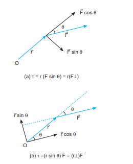
**Figure 5.7** Two ways of calculating the torque.

Based on the angle θ between r and 

F, the torque takes different values.

The torque is maximum when, r and 

F are perpendicular to each other. That is when θ = 90o and sin 90o = 1, Hence, max  rF.

The torque is zero when r and 

F are parallel or antiparallel. If parallel, then θ = 0o and sin 0o = 0. If antiparallel, then θ = 180o

and sin 180o = 0. Hence,   0. The torque is zero if the force acts at the

reference point. i.e. as r = 0,   0. The different cases discussed are shown in Table 5.1.

**Table 5.1 The Value of τ for** different cases.

**EXAMPLE 5.7** If the force applied is perpendicular to the handle of the spanner as shown in the diagram, find the (i) torque exerted by the force about the centre of the nut, (ii) direction of torque and (iii) type of rotation caused by the torque about the nut.

15 cm

2.5 N  
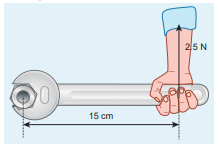
**_Solution_**

Arm length of the spanner, r = 15 cm = 15×10-2m

Force, F = 2.5 N Angle between r and F, θ = 90o

(i) Torque,   rF sin

τ = × × × °( )-15 10 2 5 902 . sin \[here, sin 90° = 1\]

(ii) As per the right hand rule, the direction of torque is out of the page.

(iii) The type of rotation caused by the torque is anticlockwise.

**EXAMPLE 5.8**

A force of  ˆˆ ˆ4i 3j 5k  N is applied at a point
whose position vector is  ˆˆ ˆ7i 4j 2k  m. Find the torque of force about the origin.

**_Solution_**
r 7i 4j ˆˆ kˆ 2    F 4i 3j ˆˆ kˆ 5    Torque,      r F i j k 7 4 2 4 ˆ 3 5 ˆ ˆ           i 20 6 j 35 8 k 21ˆˆ 1ˆ 6          14i 4 ˆˆ 3̂j 37k     N m τ = × −37 5 10 2. N m 15 cm 2.5 N 90° | r |F |
  

**EXAMPLE 5.9**

A crane has an arm length of 20 m inclined at 30o with the vertical. It carries a container of mass of 2 ton suspended from the top end of the arm. Find the torque produced by the gravitational force on the container about the point where the arm is fixed to the crane. \[Given: 1 ton = 1000 kg; neglect the weight of the arm. g = 10 m s-2\]

**_Solution_**

---
**Note**
In many problems, the angle θ between

r and 

F will not be directly given. Thus,

the students must get accustomed to identify and denote always the angle between the

r and 

F as θ. The other angles in the arrangement may be denoted as α, β, ϕ etc.

---
The force F at the point of suspension is due to the weight of the hanging mass.

F = mg = 2 × 1000 × 10 = 20000 N; The arm length, r = 20 m

We can solve this problem by three different methods.

_Method – I_ The angle (θ) between the arm length (r) and the force (F) is, θ = 150o

The torque (τ) about the fixed point of the arm is,
30 r 150 60 mg r   r F sin      20 20000 150sin     400000 90 60sin   \[here, sin cos90o    \]    400000 60cos   400000 1 2 cos 60 1 2      \= 200000 N m   2 105 N m _Method – II_ Let us take the force and perpendicular distance from the point where the arm is fixed to the crane.
   r F   r mgcos    20 60 20000cos    20 1 2 20000 \= 200000 Nm   2 105 Nm
_Method – III_ Let us take the distance from the fixed point and perpendicular force.
r 60 mg r s in 6 0 r cos 60 r    r F   r mg cos    20 20000 60cos    20 20000 1 2 \= 200000 Nm   2 105 Nm
All the three methods, give the same answer.

### Torque about an Axis

In the earlier sections, we have dealt with the torque about a point. In this section we will deal with the torque about an axis. Let us consider a rigid body capable of rotating about an axis AB as shown in Figure 5.8. Let the force F act at a point P on the rigid body. _The force F may not be on the plane ABP. We_ can take the origin O at any random point on the axis AB.
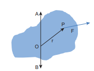
**Figure 5.8** Torque about an axis

---

Tamil Nadu is known for creative and innovative
traditional games played by children. One such
very popular game is “silli” (சில்லி) or “sillukodu”
(சில்லுக்கோடு). There is a rectangular area which
is further partitioned as seen in the Figure. One
has to hop through the rectangles. While doing so,
children lean on one side, because of the reason that
naturally the body takes this position to balance
the gravitational force (mg) and normal force (N)
acting on the body and to nullify the torque. Failing
which, both these forces act along different lines
leading to a net torque which makes one to fall.

---

The torque of the force   r F× about O is,      r F. The component of the torque     r along the axis is the torque about the axis. To find it, we should first find the vector      r F and then find the angle φ between      r F and the axis AB. (Remember here, the force   r F× is not on the plane ABP). The torque about the axis AB is the parallel component of the torque along the axis AB, which is   r F× cos φ. The torque perpendicular to the axis AB is   r F× sin φ. The torque about the axis will rotate the object about the axis and the torque perpendicular to the axis will turn or tilt the axis of rotation itself. When both components exist simultaneously on a rigid body, the body will have a _precession_. One can witness the precessional motion in a spinning top when it is about to come to rest as shown in Figure 5.9.
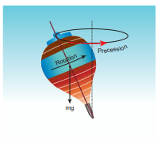
**Figure 5.9** Precession of a spinning top
Study of precession is beyond the scope of the present course of study. Hence, it is assumed that there are constraints to cancel the effect of the perpendicular components of the torques, so that the fixed position of the axis is maintained. Therefore, perpendicular components of the torque need not be taken into account.  

For the rest of the lesson, we consider rotation about only fixed axis. For this we shall,

1\. _Consider forces that lie only on planes perpendicular to the axis (without intersecting in the axis)._

2\. _Consider position vectors that are only perpendicular to the axis_.

---
**Note**

• Forces parallel to the axis will give torques perpendicular to the axis of rotation and need not be taken into account.

• Forces that intersect (pass through) the axis cannot produce torque as r = 0.

• Position vectors along the axis will result in torques perpendicular to the axis and need not be taken into account.

---

**EXAMPLE 5.10**

Two mutually perpendicular beams AB, CD, are joined at O to form a structure which is fixed to the ground firmly as shown in the Figure. A string is tied to the point D and its free end E is pulled with a force F. Find the magnitude and direction of the torque produced by the force,

(i) about the points E, D, O and B,

(ii) about the axes DE, CD, AB and BG.

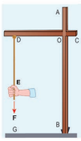

**_Solution_**

(i) Torque about point E is zero. (as      r F passes through E). Torque about point D is zero. (as      r F passes through D). Torque about point O is OE F×   ( ) which is perpendicular to axes AB and CD. Torque about point B is BE F×   ( ) which is perpendicular to axes AB and CD.
(ii) Torque about axis DE is zero (as      r F is parallel to DE). Torque about axis CD is zero (as      r F intersects CD). Torque about axis AB is zero (as      r F is parallel to AB). Torque about axis BG is zero (as      r F intersects BG).
**Identify the direction of torque in co (in Tamil, ‘Marasekku’ மரச்செக்கு)**  

The torque of a force about an axis is independent of the choice of the origin as long as it is chosen on that axis itself. This can be shown as below.

Let O be the origin on the axis AB, which is the rotational axis of a rigid body. F is the force acting at the point P. Now, choose another point O’ anywhere on the axis as shown in Figure 5.10.

**Figure 5.10** Torque about an axis is independent of origin

**untry press shown in picture**
|------|------| The torque of F about O’ is,              O P F O O OP F O O F OP F               As  O O F    is perpendicular to ′O O   , this term will not have a component along AB. Thus, the component of  O P F    is equal to that of OP F    × .
### Torque and Angular Acceleration

Let us consider a rigid body rotating about a fixed axis. A point mass m in the body will execute a circular motion about a fixed axis as shown in Figure 5.11. A tangential force 

F acting on the point mass produces the necessary torque for this rotation. This force 

F is perpendicular to the position vector r of the point mass.
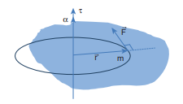
**Figure 5.11** Torque and Angular acceleration
The torque produced by the force on the point mass m about the axis can be written as,
τ = ° =r F r Fsin90  sin90 1° =\[ \]   r ma  F ma      r mr mr2  a r      mr2 (5.14)
Hence, the torque of the force acting on the point mass produces an angular acceleration   in the point mass about the axis of rotation.

In vector notation,

 

   mr2 (5.15)

The directions of τ and α are along the axis of rotation. If the direction of τ is in the direction of α, it produces angular acceleration. On the other hand if, τ is opposite to α, angular deceleration or retardation is produced on the point mass.

The term mr2 in equations 5.14 and 5.15 is called moment of inertia (I) of the point mass. A rigid body is made up of many such point masses. Hence, the moment of inertia of a rigid body is the sum of moments of inertia of all such individual point masses that constitute the body I m ri i  2 . Hence, torque for the rigid body can be written as,

 

   m ri i 2 (5.16)

 

  I (5.17)

We will learn more about the moment of inertia and its significance for bodies with different shapes in section 5.4.

### Angular Momentum

The angular momentum in rotational motion is equivalent to linear momentum in translational motion. The angular momentum of a point mass is defined as the moment of its linear momentum. In other words, the angular momentum L of a point mass having a linear momentum p at a position r with respect to a point or axis is mathematically written as,



 L r p  (5.18)

The magnitude of angular momentum could be written as,

L r p sin (5.19)

where, θ is the angle between r and p. 

L is perpendicular to the plane containing r and p. As we have written in the case of torque, here also we can associate sin θ with either r or p.

L r p r p     sin (5.20)

L r p r p     sin (5.21)

where, p⊥ is the component of linear momentum p perpendicular to r, and r⊥ is the component of position r perpendicular to p.

The angular momentum is zero L  0 , if the linear momentum is zero (p = 0) or if the particle is at the origin r  0 or if r and p are parallel or antiparallel to each other (θ = 00 or 1800).

There is a misconception that the angular momentum is a quantity that is associated only with rotational motion. It is not true. The angular momentum is also associated with bodies in the linear motion. Let us understand the same with the following example.  

**EXAMPLE 5.11**

A particle of mass (m) is moving with constant velocity (v). Show that its angular momentum about any point remains constant throughout the motion.

**_Solution_**
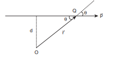
Let the particle of mass m move with constant velocity v . As it is moving with constant velocity, its path is a straight line. Its momentum  p mv  is also directed along the same path. Let us fix an origin (O) at a perpendicular distance (d) from the path. At a particular instant, we can connect the particle which is at positon Q with a position vector   

r OQ . Take, the angle between the r and p as θ.

The magnitude of angular momentum of that particle at that instant is,

L OQ p OQmv mv OQ    sin sin sin  

The term OQsin  is the perpendicular distance (d) between the origin and line along which the mass is moving. Hence, the angular momentum of the particle about the origin is,

L mvd=

The above expression for angular momentum L, does not have the angle θ. As the momentum (p = mv) and the
| Q θ |
|------|------|
| θr |
perpendicular distance (d) are constants, the angular momentum of the particle is also constant. Hence, the angular momentum is associated with bodies with linear motion also. If the straight path of the particle passes through the origin, then the angular momentum is zero, which is also a constant.

### Angular Momentum and Angular Velocity

Let us consider a rigid body rotating about a fixed axis. A point mass m in the body will execute a circular motion about the fixed axis as shown in Figure 5.12.
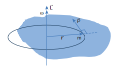
**Figure 5.12** Angular momentum and angular velocity
The point mass m is at a distance r from the axis of rotation. Its linear momentum at any instant is tangential to the circular path. Then the angular momentum



L is perpendicular to r and p. Hence, it is directed along the axis of rotation. The angle θ between r and p in this case is 90o. The magnitude of the angular momentum L could be written as,

L r mv r mv= =sin90

where, v is the linear velocity. The relation between linear velocity v and angular velocity ω in a circular motion is, v r . Hence,  

L rmr 

L mr  2  (5.22)

The directions of L and ω are along the axis of rotation. The above expression can be written in the vector notation as,



L mr  2  (5.23)

As discussed earlier, the term mr2 in equations 5.22 and 5.23 is called moment of inertia (I) of the point mass. A rigid body is made up of many such point masses. Hence, the moment of inertia of a rigid body is the sum of moments of inertia of all such individual point masses that constitute the body I m ri i  2 . Hence, the angular momentum of the rigid body can be written as,



L m ri i   2  (5.24)



L I  (5.25)

The study about moment of inertia (I) is reserved for Section 5.4.

### Torque and Angular Momentum
We have the expression for magnitude of angular momentum of a rigid body as, L I . The expression for magnitude of torque on a rigid body is,   I

We can further write the expression for torque as,

   I d dt          d dt (5.26)

|------|------|------|------|------|
| P |
Where, ω is angular velocity and α is angular acceleration. We can also write equation 5.26 as,

 

  d I dt

  dL dt

(5.27)

The above expression says that an external torque on a rigid body fixed to an axis produces rate of change of angular momentum in the body about that axis. This is the Newton’s second law in rotational motion as it is in the form of F dp

dt = which

holds good for translational motion.

_Conservation of angular momentum:_ From the above expression we could conclude that in the absence of external torque, the angular momentum of the rigid body or system of particles is conserved.

If   0 then, dL dt

constant= =0; L

The above expression is known as law of conservation of angular momentum. We will learn about this law further in section 5.5.

##EQUILIBRIUM OF RIGID BODIES

When a body is at rest without any motion on a table, we say that there is no force acting on the body. Actually it is wrong because, there is gravitational force acting on the body downward and also the normal force exerted by table on the body upward. These two forces cancel each other and thus  

there is no net force acting on the body. There is a lot of difference between the terms “no force” and “no net force” acting on a body. The same argument holds good for rotational conditions in terms of torque or moment of force.

_A rigid body is said to be in mechanical equilibrium when both its linear momentum and angular momentum remain constant._

When the linear momentum remains constant, the net force acting on the body is zero.



Fnet = 0 (5.28)

In this condition, the body is said to be in translational equilibrium. This implies that the vector sum of different forces

   …F F F1 2 3, ,

acting in different directions on the body is zero.

   

F F F Fn1 2 3 0     (5.29)

If the forces   

…F F F1 2 3, , act in different directions on the body, we can resolve them into horizontal and vertical components and then take the resultant in the respective directions. In this case there will be horizontal as well as vertical equilibria possible.

Similarly, when the angular momentum remains constant, the net torque acting on the body is zero.



net  0 (5.30)

Under this condition, the body is said to be in rotational equilibrium. The vector sum of different torques    …τ τ τ1 2 3, , producing different senses of rotation on the body is zero.

      1 2 3 0    n (5.31)

Thus, we can also conclude that a rigid body is in mechanical equilibrium when the net force and net torque acts on the body is zero.



Fnet = 0 and net  0 (5.32)

**Table 5.2 Different types of Equilibrium an** Type of equilibrium Translational equilibrium

„ Linear momentum is consta „ Net force is zero.

Rotational equilibrium

„ Angular momentum is cons „ Net torque is zero.

Static equilibrium

„ Linear momentum and ang „ Net force and net torque are

Dynamic equilibrium

„ Linear momentum and ang „ Net force and net torque are

Stable equilibrium

„ Linear momentum and ang „ The body tries to come ba

released. „ The centre of mass of the b

equilibrium. „ Potential energy of the body

Unstable equilibrium

„ Linear momentum and ang „ The body cannot come ba

released. „ The centre of mass of the

equilibrium. „ Potential energy of the body

Neutral equilibrium

„ Linear momentum and ang „ The body remains at the

released. „ The centre of mass of the bo

from equilibrium. „ Potential energy remains sa  

As the forces and torques are vector quantities, the directions are to be taken with proper sign conventions.

### Types of Equilibrium

Based on the above discussions, we come to a conclusion that different types of equilibrium are possible based on the different conditions. They are consolidated in Table 5.2.

d their Conditions. Conditions

nt.

tant.

ular momentum are zero. zero.

ular momentum are constant. zero.

ular momentum are zero. ck to equilibrium if slightly disturbed and

ody shifts slightly higher if disturbed from

is minimum and it increases if disturbed. ular momentum are zero. ck to equilibrium if slightly disturbed and

body shifts slightly lower if disturbed from

is not minimum and it decreases if disturbed. ular momentum are zero. same equilibrium if slightly disturbed and

dy does not shift higher or lower if disturbed

me even if disturbed.

**EXAMPLE 5.12**

Arun and Babu carry a wooden log of mass 28 kg and length 10 m which has almost uniform thickness. They hold it at 1 m and 2 m from the ends respectively. Who will bear more weight of the log? \[g = 10 ms-2\]

**_Solution_**

Let us consider the log is in mechanical equilibrium. Hence, the net force and net torque on the log must be zero. The gravitational force acts at the centre of mass of the log downwards. It is cancelled by the normal reaction forces RA and RB applied upwards by Arun and Babu at points A and B respectively. These reaction forces are the weights borne by them.

The total weight, W = mg = 28 × 10 = 280 N, has to be borne by them together. The reaction forces are the weights borne by each of them separately. Let us show all the forces acting on the log by drawing a free body diagram of the log.

_For translational equilibrium:_ The net force acting on the log must be zero.

R mg RA B     0

Here, the forces RA an RB are taken positive as they act upward. The gravitational force acting downward is taken negative.

R R mgA B   

_For rotational equilibrium:_

The net torque acting on the log must be zero. For ease of calculation, we can take the torque caused by all the forces about the point A on the log. The forces are perpendicular to the distances. Hence,

0 4 7 0R mg RA B         .

Here, the reaction force RA cannot produce any torque as the reaction forces pass through the point of reference A. The torque of force mg produces a clockwise turn about the point A which is taken negative and torque of force RB causes anticlockwise turn about A which is taken positive.

7 4R mgB =

R mgB = 4 7

R NB     4 7

28 10 160

By substituting for RB we get,

R mg RA B 

R NA      28 10 160 280 160 120

As RB is greater than RA, it is concluded that Babu bears more weight than Arun. The one closer to centre of mass of the log bears more weight.

| For rotational equilibrium:e n et t orque ac ting o n t he log must b e zer o. F or e ase o f c alculation, we c an t ake t he t orque c aused b y a ll t he forces a bout t he p oint A o n t he log .  e forces a re p erpendicular t o t he di stances. Hence,   04Rm  gR 70  .Here, t he r eaction f orce R  c annot produce a nABy t orque a s t he r eaction f orces pass  through  the  point  of  reference  A.  e torque  of  force  mg  produces  a  clockwise Aturn a bout t he p oint A w hich i s t aken negative  and  torque  of  force  R causes anticlockwise t urn a bout A w hich i s t aken positive.B74Rm= g4Rm= g74 BRN 28 10 1607BBy substituting for R we get,BRm gRRN 28 10 160 B  280 160 120ABAs R  i s g reater t han R , i t i s co ncluded that BA abu b ears m ore w eight t han A run. e o ne c loser t o centre o f m ass o f t he log bears more weight.B A |
|------|

### Couple

Consider a thin uniform rod AB. Its centre of mass is at its midpoint C. Let two forces which are equal in magnitude and opposite in direction be applied at the two ends A and B of the rod perpendicular to it. The two forces are separated by a distance of 2r as shown in Figure 5.13.

**Figure 5.13** Couple

A B Cr r

As the two equal forces are opposite in direction, they cancel each other and the net force acting on the rod is zero. Now the rod is in translational equilibrium. But, the rod is not in rotational equilibrium. Let us see how it is not in rotational equilibrium. The moment of the force applied at the end A taken with respect to the centre point C, produces an anticlockwise rotation. Similarly, the moment of the force applied at the end B also produces an anticlockwise rotation. The moments of both the forces

**Figure 5.14 Turning effect of Co**
cause the same sense of rotation in the rod. Thus, the rod undergoes a rotational motion or turning even though the rod is in translational equilibrium.

_A pair of forces which are equal in magnitude but opposite in direction and separated by a perpendicular distance so that their lines of action do not coincide that causes a turning effect is called a couple. We_ come across couple in many of our daily activities as shown in Figure 5.14.

---
**Note**
There are cases in which the two forces may not cancel each other. If the two forces are not equal or the direction of the forces is not exactly opposite, then the body will have both translational as well as rotational motion.

---
### Principle of Moments

Consider a light rod of negligible mass which is pivoted at a point along its length. Let two parallel forces F1 and F2 act at the two ends at distances d1 and d2 from the point of pivot and the normal reaction force N at the point of pivot as shown in Figure 5.15. If the rod has to remain stationary in horizontal position, it should be in translational and rotational equilibrium. Then, both the net force and net torque must be zero.
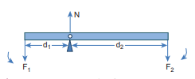
**Figure 5.15** Principle of Moments F1 F2

N

d2d1

For translational equilibrium, net force has to be zero,    F N F1 2 0

N F F 1 2

For rotational equilibrium, net torque has to be zero, d F d F1 1 2 2 0 

d F d F1 1 2 2= (5.33)

The above equation represents the principle of _moments. This forms the principle for beam_ balance used for weighing goods with the condition d1 = d2; F1 = F2. We can rewrite the equation 5.33 as,
F F d d 1 2 2 1 \= (5.34)
If F1 is the load and F2 is our effort, we get advantage when, d1< d2. This implies that F1> F2. Hence, we could lift a large load with small effort. The ratio d d

2 1       is called
mechanical advantage of the simple lever. The pivoted point is called fulcrum.  

Mechanical Advantage MA d d

   2

1

(5.35)

There are many simple machines that work on the above mentioned principle.

### Centre of Gravity

Each rigid body is made up of several point masses. Such point masses experience gravitational force towards the centre of Earth. As the size of Earth is very large compared to any practical rigid body we come across in daily life, these forces appear to be acting parallelly downwards as shown in Figure 5.16.

**Figure 5.16.** Centre of gravity

The resultant of these parallel forces always acts through a point. This point is called centre of gravity of the body (with respect to Earth). The _centre of gravity of a body is the point at which the entire weight of the body acts irrespective of the position and orientation of the body_. The centre of gravity and centre of mass of a rigid body coincide when the gravitational field is uniform across the body. The concept of gravitational field is dealt in Unit 6.
We can also determine the centre of gravity of a uniform lamina of even an irregular shape by pivoting it at various points by trial and error. The lamina remains horizontal when pivoted at the point where the net gravitational force acts, which is the centre of gravity as shown in Figure 5.17. When a body is supported at the centre of gravity, the sum of the torques acting on all the point masses of the rigid body becomes zero. Moreover the weight is compensated by the normal reaction force exerted by the pivot. The body is in static equilibrium and hence it remains horizontal.

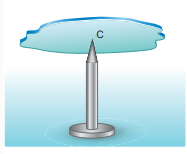
**Figure 5.17.** Determination of centre of gravity of plane lamina by pivoting

There is also another way to determine the centre of gravity of an irregular lamina. If we suspend the lamina from different
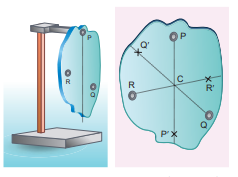
**Figure 5.18** Determination of centre of gravity of plane lamina by suspending
points like P, Q, R as shown in Figure 5.18, the vertical lines PP', QQ', RR' all pass through the centre of gravity. Here, reaction force acting at the point of suspension and the gravitational force acting at the centre of gravity cancel each other and the torques caused by them also cancel each other.

### Bending of Cyclist in Curves

Let us consider a cyclist negotiating a circular level road (not banked) of radius r with a speed v. The cycle and the cyclist are considered as one system with mass m. The centre gravity of the system is C and it goes in a circle of radius r with centre at O. Let us choose the line OC as X-axis and the vertical line through O as Z-axis as shown in Figure 5.19.

**Figure 5.19** Bending of cyclist
The system as a frame is rotating about Z-axis. The system is at rest in this rotating frame. To solve problems in rotating frame of reference, we have to apply a centrifugal force (pseudo force) on the system which will be mv r
This force will act through the centre of gravity. The forces acting on the system are, (i) gravitational force (mg), (ii) normal force (N), (iii) frictional force (f ) and (iv) centrifugal force mv system is in equilibrium in the rotational frame of reference, the net external force and net external torque must be zero. Let us consider all torques about the point A in Figure 5.20.
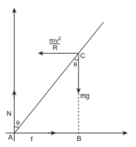
**Figure 5.20** Force diagrams for the cyclist in turns
For rotational equilibrium,
 net  0  
The torque due to the gravitational force about point A is mg AB  which causes a clockwise turn that is taken as negative. The torque due to the centrifugal force is
mv r BC 2      which causes an anticlockwise turn that is taken as positive.   mg AB mv r BC 2 0 mg AB mv r BC= 2 From D ABC, AB AC sin and BC AC cos mg AC mv r ACsin cos  2 tan  v rg 2         tan 1 2v rg (5.36)
While negotiating a circular level road of radius r at velocity v, a cyclist has to bend by an angle θ from vertical given by the above expression to stay in equilibrium (i.e. to avoid a fall).

**EXAMPLE 5.13**

A cyclist while negotiating a circular path with speed 20 m s-1 is found to bend an angle by 30o with vertical. What is the radius of the circular path? (given, g = 10 m s-2)

| mvR2Cθmgθ |
|------|------|
**_Solution_**

Speed of the cyclist, v = 20 m s-1

Angle of bending with vertical, θ = 30o

Equation for angle of bending, tan  v rg
2 Rewriting the above equation for radius r v g  2 tan Substituting, r                 20 30 10 20 20 30 10 400 1 3 10 2 tan tan  r     3 40 1 732 40. r m= 69 28.

## MOMENT OF INERTIA

In the expressions for torque and angular momentum for rigid bodies (which are considered as bulk objects), we have come across a term Σm ri i 2\. This quantity is called moment of inertia (I) of the bulk object. For point mass mi at a distance ri from the fixed axis, the moment of inertia is given as, m ri i2.

Moment of inertia for point mass,

I m ri i= 2 (5.37)

Moment of inertia for bulk object,

I m ri i 2 (5.38)

In translational motion, mass is a measure of inertia; in the same way, for rotational motion, moment of inertia is a measure of rotational inertia. The unit of moment of inertia is, kg m2. Its dimension is M L2. In general, mass is an invariable quantity of matter (except for motion comparable to that of light). But, the moment of inertia of a body is not an invariable quantity. It depends not only on the mass of the body, but also on the way the mass is distributed around the axis of rotation.

To find the moment of inertia of a uniformly distributed mass; we have to consider an infinitesimally small mass (dm) as a point mass and take its position (r) with respect to an axis. The moment of inertia of this point mass can now be written as,

dI dm r   2 (5.39)

We get the moment of inertia of the entire bulk object by integrating the above expression.

I dI dm r     2

I r dm  2 (5.40)

We can use the above expression for determining the moment of inertia of some of the common bulk objects of interest like rod, ring, disc, sphere etc.

### Moment of Inertia of a Uniform Rod

Let us consider a uniform rod of mass (M) and length () as shown in Figure 5.21. Let us find an expression for moment of inertia of this rod about an axis that passes through the centre of mass and perpendicular to| SolutionSpeed of the cyclist, v = 20 m sAngle of bending with vertical, θ = 30vEquation for angle of bending,  tan -1 rgoRewriting t he a bove e quation f or radi us 2vr tan  gSubstitu2 ting,   20 20  20r  tant30  10 an 30  10 400 2 1   10 3 r  34  01 .732  40rm= 69.28 |
|------|the rod. First an origin is to be fixed for the coordinate system so that it coincides with the centre of mass, which is also the geometric centre of the rod. The rod is now along the x axis. We take an infinitesimally small mass (dm) at a distance (x) from the origin. The moment of inertia (dI) of this mass (dm) about the axis is,
dI dm x   2 As the mass is uniformly distributed, the mass per unit length (l) of the rod is, l = M  The (dm) mass of the infinitesimally small length as, dm = l dx = M dx  The moment of inertia (I) of the entire rod can be found by integrating dI, I dI dm x M dx x            2 2  I M x dx   2
As the mass is distributed on either side of the origin, the limits for integration are taken from − / 2 to  / 2.
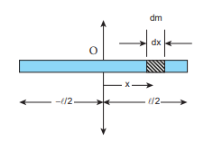
**Figure 5.21** Moment of inertia of uniform rod
/2−/2 dx dm x O I M x dx M x                  / / / / 2 2 2 3 2 2 3 I M M                              3 3 3 3 24 24 24 24 I M               2 24 3 I M= 1 12 2  (5.41)
**EXAMPLE 5.14**

Find the moment of inertia of a uniform rod about an axis which is perpendicular to the rod and touches any one end of the rod.

**_Solution_**

The concepts to form the integrand to find the moment of inertia could be borrowed from the earlier derivation. Now, the origin is fixed to the left end of the rod and the limits are to be taken from 0 to .
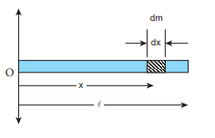

---
**Note**
The moment of inertia of the same uniform rod is different about different axes of reference. The reference axes could be even outside the object. We have two useful theorems to calculate the moments of inertia about different axes. We shall see these theorems in Section 5.4.5.

---

### Moment of Inertia of a Uniform Ring

Let us consider a uniform ring of mass M and radius R. To find the moment of inertia of the ring about an axis passing through its centre and perpendicular to the plane, let us take an infinitesimally small mass (dm) of length (dx) of the ring. This (dm) is located at a distance R, which is the radius of the ring from the axis as shown in Figure 5.22.
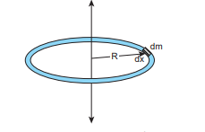
**Figure 5.22** Moment of inertia of a uniform ring
The moment of inertia (dI) of this small mass (dm) is,

dI dm R   2

The length of the ring is its circumference 2R . As the mass is uniformly  

distributed, the mass per unit length (l) is,
l   mass length M R2 The mass (dm) of the infinitesimally small length is, dm = l dx = M R dx 2p Now, the moment of inertia (I) of the entire ring is, I dI dm R M R dx R            2 2 2 I MR dx 2
To cover the entire length of the ring, the limits of integration are taken from 0 to 2pR.
I MR dx R  2 0 2   I MR x MR RR       2 2 2 0 0 2     I MR= 2 (5.42)
### Moment of Inertia of a Uniform Disc

Consider a disc of mass M and radius R. This disc is made up of many infinitesimally small rings as shown in Figure 5.23. Consider one such ring of mass (dm) and thickness (dr) and radius (r). The moment of inertia (dI) of this small ring is, dI dm r   2 As the mass is uniformly distributed, the mass per unit area (s) is, s   mass area M R 2 | I I IM= | |------| The mass of the infinitesimally small ring is,
dm rdr M R rdr    2 22 where, the term 2r dr  is the area of this elemental ring (2pr is the length and dr is the thickness). dm M R rdr= 2 2 dI M R r dr= 2 2 3 The moment of inertia (I) of the entire disc is, I dI  I M R dr M R dr RR \= = ∫∫ 2 2 2 3 2 3 00 _r r_ I M R M R                2 4 2 4 02 4 0 2 4_r R R_ I MR= 1 2 2 (5.43)
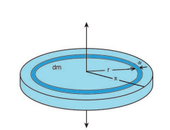
**Figure 5.23** Moment of inertia of a uniform disc  

### Radius of Gyration

For bulk objects of regular shape with uniform mass distribution, the expression for moment of inertia about an axis involves their total mass and geometrical features like radius, length, breadth, which take care of the shape and the size of the objects. But, we need an expression for the moment of inertia which could take care of not only the mass, shape and size of objects, but also its orientation to the axis of rotation. Such an expression should be general so that it is applicable even for objects of irregular shape and non-uniform distribution of mass. The general expression for moment of inertia is given as,

I MK= 2 (5.44)

where, M is the total mass of the object and K is called the radius of gyration.

_The radius of gyration of an object is the perpendicular distance from the axis of rotation to an equivalent point mass, which would have the same mass as well as the same moment of inertia of the object_.

As the radius of gyration is distance, its unit is m. Its dimension is \[L\].

A rotating rigid body with respect to any axis, is considered to be made up of point masses m1, m2, m3, . . .mn at perpendicular distances (or positions) r1, r2, r3 . . . rn respectively as shown in Figure 5.24.

The moment of inertia of that object can be written as,

I i i n n i

n m r m r m r m r m r=

\= = + + + +∑ 2

1 1 2

2 2 2

3 3 2 2

1 

If we take all the n number of individual masses to be equal,

**Figure 5.24** Radius of gyration
m m m m mn= = = = =1 2 3 . . . then, I mr mr mr mrn    1 2 2 2 3 2 2       m r r r rn1 2 2 2 3 2 2           nm r r r r n n1 2 2 2 3 2 2  I MK= 2 where, nm is the total mass M of the body and K is the radius of gyration. K r r r r n n    1 2 2 2 3 2 2  (5.45) _The expression for radius of gyration indicates that it is the root mean square (rms) distance of the particles of the body from the axis of rotation._  

In fact, the moment of inertia of any object could be expressed in the form, I = MK2.

For example, let us take the moment of inertia of a uniform rod of mass M and length . Its moment of inertia with respect to a perpendicular axis passing through the

centre of mass is, I M= 1 12

2 

In terms of radius of gyration, I MK= 2

Hence, MK M2 21 12

\= 

K2 21 12

\= 

K l= 12  or K l=

2 3  or K = ( )0 289. 

**EXAMPLE 5.15**

Find the radius of gyration of a disc of mass M and radius R rotating about an axis passing through the centre of mass and perpendicular to the plane of the disc.

**_Solution_**

The moment of inertia of a disc about an axis passing through the centre of mass

and perpendicular to the disc is, I MR= 1 2

2

In terms of radius of gyration, I MK= 2

Hence, MK MR2 21 2

\= ; K R2 21 2

\=

K l R= 2

or K l R= 1 414.

or K R  0 707.

From the case of a rod and also a disc, we can conclude that the radius of gyration of the rigid body is always a geometrical feature like length, breadth, radius or their combinations with a positive numerical value multiplied to it.
| Find t he radi us o f g yration o f a di sc o fmass M and radius R rotating about an axispassing t hrough t he cen tre o f m ass a ndperpendicular to the plane of the disc.Solutione m oment o f in ertia o f a di sc a bout a n axis p assing t hrough t he cen tre o f m ass 1and perpendicular to the disc is,  IM= R2In terms of radius of g yration,  IM= K1 1 2Hence,  MK = MR ; KR=2 2 2l lK = R  or K = R or KR 0.7072 22 1.414 22From t he c ase o f a r od a nd a lso a di sc, w ecan  conclude  that  the  radius  of  g yrationof t he r igid b ody i s a lways a g eometricalfeature li ke len gth, b readth, radius o r t heircombinations w ith a p ositive n umericalvalue multiplied to it. |
|------|

### Theorems of Moment of Inertia

As the moment of inertia depends on the axis of rotation and also the orientation of the body about that axis, it is different for the same body with different axes of rotation. We have two important theorems to handle the case of shifting the axis of rotation.

**(i) Parallel axis theorem:** _Parallel axis theorem states that the moment of inertia of a body about any axis is equal to the sum of its moment of inertia about a parallel axis through its centre of mass and the product of the mass of the body and the square of the perpendicular distance between the two axes._

---
Obesity, torque and Moment of Inertia!

Obesity and associated ailments like back pain, joint pain etc. are due to the shift in centre of mass of the body. Due to this shift in centre of mass, unbalanced torque acting on the body leads to ailments. As the mass is spread away from centre of the body the moment of inertia is more and turning will also be difficult.

---
mg mg

N N

r  

If IC is the moment of inertia of the body of mass M about an axis passing through the centre of mass, then the moment of inertia I about a parallel axis at a distance d from it is given by the relation,

I I MdC  2 (5.46)

Let us consider a rigid body as shown in Figure 5.25. Its moment of inertia about an axis AB passing through the centre of mass is IC. DE is another axis parallel to AB at a perpendicular distance d from AB. The moment of inertia of the body about DE is I. We attempt to get an expression for I in terms of IC. For this, let us consider a point mass m on the body at position x from its centre of mass.
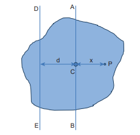
**Figure 5.25** Parallel axis theorem

The moment of inertia of the point mass about the axis DE is, m x d 2.

The moment of inertia I of the whole body about DE is the summation of the above expression.

I m x d   2
This equation could further be written as,

I m x d xd    2 2 2

I mx md dmx    2 2 2

I mx md d mx    2 2 2

Here, I mxC  2 is the moment of inertia of the body about the centre of mass. Hence, I mxC  2

The term,  mx 0 because, x can take positive and negative values with respect to the axis AB. The summation  mx will be zero.

Thus, I I md I m dC C      2 2

Here, Σm is the entire mass M of the object   m M

I I MdC  2

Hence, the parallel axis theorem is proved.

**(ii) Perpendicular axis theorem:** This perpendicular axis theorem holds good only for plane laminar objects.

_The theorem states that the moment of inertia of a plane laminar body about an axis perpendicular to its plane is equal to the sum of moments of inertia about two perpendicular axes lying in the plane of the body such that all the three axes are mutually perpendicular and have a common point._

Let the X and Y-axes lie in the plane and Z-axis perpendicular to the plane of the laminar object. If the moments of inertia of  

the body about X and Y-axes are I_X_ and I_Y_ respectively and I_Z_ is the moment of inertia about Z-axis, then the perpendicular axis theorem could be expressed as,

I I IZ X Y  (5.47)

To prove this theorem, let us consider a plane laminar object of negligible thickness on which lies the origin (O). The X and Y-axes lie on the plane and Z-axis is perpendicular to it as shown in Figure 5.26. The lamina is considered to be made up of a large number of particles of mass m. Let us choose one such particle at a point P which has coordinates (x, y) at a distance r from O.
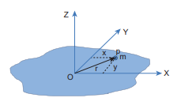
**Figure 5.26** Perpendicular axis theorem

The moment of inertia of the particle about Z-axis is, mr2

The summation of the above expression gives the moment of inertia of the entire lamina about Z-axis as, I mr_Z_  2

Here, r x y2 2 2 

Then, I m x y_Z_    2 2

I mx my_Z_   2 2

In the above expression, the term Σmx2 is the moment of inertia of the body about the Y-axis and similarly the term Σmy2 is the moment of inertia about X-axis. Thus,

I myX  2 and I mxY  2

Substituting in the equation for Iz gives,

I I I_Z X Y_ 

Thus, the perpendicular axis theorem is proved.

**EXAMPLE 5.16**

Find the moment of inertia of a disc of mass 3 kg and radius 50 cm about the following axes.

(i) axis passing through the centre and perpendicular to the plane of the disc,

(ii) axis touching the edge and perpendicular to the plane of the disc and

(iii) axis passing through the centre and lying on the plane of the disc.

**_Solution_**

The mass, M = 3 kg, radius R = 50 cm = 50 × 10-2 m = 0.5 m

(i) The moment of inertia (I) about an axis passing through the centre and perpendicular to the plane of the disc is,  

I MR= 1 2

2

I         1 2

3 0 5 0 5 3 0 5 0 52. . . .

I kg m= 0 375 2.

(ii) The moment of inertia (I) about an axis touching the edge and perpendicular to the plane of the disc by parallel axis theorem is,

I I MdC  2

where, I MRC = 1 2

2 and d = R

I MR MR MR   1 2

3 2

2 2 2

I         3 2

3 0 5 1 5 3 0 5 0 52. . . .

I kg m=1 125 2.
| 1IM=21I 2Ik= 0.375 |
|------|
| 1IM23I 2Ik= 1.125 |
|------|
(iii) The moment of inertia (I) about an axis passing through the centre and lying on the plane of the disc is,

I I I_Z X Y_ 

where, I I I_X Y_\= = and I MR_Z_ \= 1 2

2

I I_Z_ \= 2 ; I I= 1 2 _Z_

I MR MR   1 2

1 2

1 4

2 2

I         1 4

3 0 5 0 25 3 0 5 0 52. . . .

I kg m= 0 1875 2.

„ About which of the above axis it is easier to rotate the disc?

„ It is easier to rotate the disc about an axis about which the moment of inertia is the least. Hence, it is case (iii).

**EXAMPLE 5.17**

Find the moment of inertia about the geometric centre of the given structure made up of one thin rod connecting two similar solid spheres as shown in Figure.  

**_Solution_** The structure is made up of three objects; one thin rod and two solid spheres.

The mass of the rod, M = 3 kg and the total length of the rod, ℓ = 80 cm = 0.8 m

The moment of inertia of the rod

about its centre of mass is, I Mrod = 1

12 2 

Irod       1

12 3 0 8 1

4 0 642. .

I kg mrod = 0 16 2.

The mass of the sphere, M = 5 kg and the radius of the sphere, R = 10 cm = 0.1 m

The moment of inertia of the sphere

about its centre of mass is, I MRC = 2 5

2

The moment of inertia of the sphere about geometric centre of the structure is, I I Mdsph C  2

Where, d = 40 cm + 10 cm = 50 cm = 0.5 m

I MR Mdsph   2 5

2 2

Isph       2 5

5 0 1 5 0 52 2. .

Isph = × + × = +( . ) ( . ) . .2 0 01 5 0 25 0 02 1 25 I kg msph =1 27 2.

As there are one rod and two similar solid spheres we can write the total moment of inertia (I) of the given geometric structure as, I I Irod sph= + ×( )2

I = + × = +( . ) ( . ) . .0 16 2 1 27 0 16 2 54

I kg m= 2 7 2.

### Moment of Inertia of Different Rigid Bodies
 The moment of inertia of different objects about different axes is given in the Table 5.3.
 | (iii) e m oment o f in ertia (I) a bout a n axis p assing t hrough t he cen tre a nd lying on the plane of the disc is,II  I1where,   II = =  and IM= RZX Y 21II = 2 ;  II= 2XY 2 Z1 1 1IM RM R2 2  4Z 1 ZI  30 ..50  2530  ..504 22Ik= 0.1875 gm2About w hich o f t he a bove axi s i t i s 2easier to rotate the disc? It i s e asier t o r otate t he di sc a bout„an axi s a bout w hich t he m oment o finertia is the least. Hence, it is case (iii).„ |
|------|

| 2IM 52I 5sphI =×(.20Iksph = 12.sphsph |
|------|
| Solutione s tructure i s m ade u p o f t hree o bjects; one thin rod and two solid spheres.e m ass o f t he r od, M  = 3 kg a nd t he total length of the rod, ℓ = 80 cm = 0.8 me m oment o f in ertia o f t he r od about i ts cen tre o f m ass i s, 1 IM = 12 1 1I  30 ..8  06 412 4 2Ik = 01. 6 gm rod2rode m ass o f t he s phere, M  = 5 kg a nd t he radius of the sphere, R = 10 cm 2 = 0.1 mrode m oment o f in ertia o f t he s phere about its centre of mass is, 2IM= Re m oment o f in ertia o f t5 he s phere about g eometric cen tre o f t he s tructure i s, 2CII  MdWhere, d = 40 cm + 10 cm = 50 cm = 0.5 m2sphC2IM  RM d5  2I  50 ..15  055 22sphI =×(.20 01)(+× 2250 .)25 =+00.. 21 25Iksph = 12. 7 gmAs t here a re o ne r od  and  two simi lar s olid sphsperh es w e c an w rite t he t otal m oment o f 2inersph tia (I) o f t he g iven geometric structure as, II=+ ()2 × II =+(.01 62)( ×=12.) 70 ..16 + 25 4rods phIk= 27. gm2 |
|------|

## ROTATIONAL DYNAMICS
The relations among torque, angular acceleration, angular momentum, angular velocity and moment of inertia were seen in Section 5.2. In continuation to that, in this section, we will learn the relations among the other dynamical quantities like work, kinetic energy in rotational motion of rigid bodies. Finally a comparison between the translational and rotational quantities is made with a tabulation.

### Effect of Torque on Rigid Bodies
A rigid body which has non zero external torque   about the axis of rotation would have an angular acceleration   about that axis. The scalar relation between the torque and angular acceleration is,

  I (5.48)

where, I is the moment of inertia of the rigid body. The torque in rotational motion is equivalent to the force in linear motion.

**EXAMPLE 5.18**

A disc of mass 500 g and radius 10 cm can freely rotate about a fixed axis as shown in figure. light and inextensible string is wound several turns around it and 100 g body is suspended at its free end. Find the acceleration of this mass. \[Given: The string makes the disc to rotate and does not slip over it. g = 10 m s-2.\]  

m1

m2

R

**_Solution_**

Let the mass of the disc be m1 and its radius R. The mass of the suspended body is m2.

m1 = 500 g = 500×10-3 kg =0.5 kg m2 = 100 g = 100×10-3 kg = 0.1 kg R = 10 cm = 10×10-2 m = 0.1 m

As the light inextensible string is wound around the disc several times it makes the disc rotate without slipping over it. The translational acceleration of m2 and tangential acceleration of m1 will be the same. Let us draw the free body diagram (_FBD_) of m1 and m2 separately.

_FBD of the disc:_

T

R

N

m1g

m1

|   2 2K RRatio    |-- |-- |1 |2 |1 2 |3 2 |1 2 |3 2 |1 4 |5 4 |
|------|------|------|------|------|------|------|------|------|------|------|------|------|
| esdioid Bigt Rerenf Dirtia onef It onmeoMTable 5.3 |(K)Radius of Gyration | 12 | 3 |b22  12() |R |R2 |R  1 2   |R   3 2    |R 1 2√ |R |R 1 2 |R 4 |

| 2Moment of Inertia (I) kg m |2 M1 12 |2M1 3 |22 ()Mb1 12 |2MR |2MR2 |2MR1 2 |2MR3 2 |MR1 2 |MR3 2 |MR1 4 |MR5 4 |
| Diagram |
| n axist auobA |hgte lenho tlar tudicenperd pntre ae cenhh toughrg tassinP |hgte lenho tlar tudicenperd pnd ae enng ohinoucT |e hf te olane pho tlar tudicenperd pntre ae cenhh toughrg tassin etP she |elane pho tlar tudicenperd pntre ae cenhh toughrg tassinP |lar udicenpere (plane pho tlar tudicenpere pdge ehg t t)hin nTouc tange |er)etamg dinloe (alane phn tg oyintre le cenhh toughrg tassinP |t)genanl tllearae (plane pho tl tllearae pdge ehg thinoucT |elane pho tlar tudicenperd pntre ae cenhh toughrg tassinP |lar udicenpere (plane pho tlar tudicenpere)dge p lanhe e he pg t o tt tTouchin tangen |er)etamg dinloe (alane phn tg oyintre le cenhh toughrg tassinP |e ho tt tgenanl tllearae (plane pho tl tllearae pdge ehg thin e)ouc lanT p |
| ctjeOb |odorm R nifh = in U Mass = M  Lengt |; eet gth = orm  lar Sh ennif ectangu ass = M;  L readth = bin U R M B |ginorm Rnif ass = M  adius = Rin U M R |corm Disnif s = Rass = M  adiuin U M R |
| o.N |1. |2. |3. |4. |
  
| 1 |- - |1 2 |- - |2 3 |5 3 |2 5 |7 5 |
|------|------|------|------|------|------|------|------|
| R |2  12+R 2 |1 2√ |2  12+R 4 |R |R 5 3 |R |R |

| MR |2  12+R 2M |MR1 2 |2  12+R 4M |MR2 3 |MR5 3 |MR2 5 |MR7 5 |

| derylinhe cf ts ohe axing tlond atre ahe cenh toughrg tPassin |trehe cenh toughrg tassinnd ph  agthe leno tular tdicpenerg pPassin |derylinhe cf ts ohe axing tlond atre ahe cenh toughrg tPassin |trehe cenh toughrg tassinnd ph  agthe leno tular tdicpenerg pPassin |tre he cenh t er) hroug ametPassing t (along di |e dghe eg t t)Touchin (tangen |tre he cenh t er) hroug ametPassing t (along di |e dghe eg t t)Touchin (tangen |
| w lloo s = Ruadirm Ho ; Rnif er h = ylind ass = M  engtin U C M L |s = RuadiUniform  Solid Cylinder  Mass = M  Length = ; R |e ell)er hph al Sollow S pheric s = Rass = M  adiuin H (in S M R |eerhUniform  Solid Sp Mass = M  Radius = R |
| 5. |6. |7. |8. |
  

Its gravitational force (m1g) acts downward and normal force N exerted by the fixed support at the centre acts upward. The tension T acts downward at the edge. The gravitational force (m1g) and the normal force (N) cancel each other. m1g = N

The tension T produces a torque (R T), which produces a rotational motion in the

disc with angular acceleration,    

  

a R

.

Here, a is the linear acceleration of a point at the edge of the disc. If the moment of inertia of the disc is I and its radius of gyration is K, then

R T I ; R T m K a R

  1 2

T m K a R

  1 2

2

_FBD of the body:_ Its gravitational force (m2g) acts downward and the tension T acts upward. As (T < m2g), there is a resultant force (m2a) acting on it downward.

T

m2g

m2am2

m g T m a2 2 

Substituting for T from the equation for disc,  

m g m K a

R m a2 1
### Conservation of Angular Momentum

When no external torque acts on the body, the net angular momentum of a rotating rigid body remains constant. This is known as law of conservation of angular momentum.

| a  m 2 |
|------|
| aa(Racces |mg mK a  maRamg  mK 2  ma21  RK2  2 mg   m   ma21  2 R2  2 m2a 21  K2  2  m   m  R  22 K  1 2 2ession    f or a di sc r R s p assing  through t h2endicular t o t he p lane i s, 2le  5.3) N ow t he exp resn further simplies as, m 2mg  ; a   mm  m  21g the values,  12220 .1 02. 1 =  × 1005..  02 07.am 2.857 s2 |g |
|------|------|------|------|

| otating e cen tre K 1= . R 2sion f or 22 |
| e exp rbout a n axind p erpef T ableratioa  m 2ubstitutina  |

| g22 |
| m2 |
  

  dL dt

If   0 then, L constant= (5.49)

As the angular momentum is L I , the conservation of angular momentum could further be written for initial and final situations as,

I I_i i f f_  (or) Iw = constant (5.50)

The above equations say that if I increases ω will decrease and vice-versa to keep the angular momentum constant.

There are several situations where the principle of conservation of angular momentum is applicable. One striking example is an ice dancer as shown in Figure 5.27. The dancer spins slowly when the hands are stretched out and spins faster when the hands are brought close to the body. Stretching of hands away from body increases moment of inertia, thus the angular velocity decreases resulting in slower spin. When the hands are brought close to the body, the moment of inertia decreases, and

**Figure 5.27** Conservation of angu

_I_ - large

ω - small  

thus the angular velocity increases resulting in faster spin.

A diver while in air as in Figure 5.28 curls the body close to decrease the moment of inertia, which in turn helps to increase the number of somersaults in air.

**Figure 5.28** Conservation of angular momentum for a diver

lar momentum for ice dancer

_I_ - small

ω - large

**EXAMPLE 5.19**

A jester in a circus is standing with his arms extended on a turn table rotating with angular velocity ω. He brings his arms closer to his body so that his moment of inertia is reduced to one third of the original value. Find his new angular velocity. \[Given: There is no external torque on the turn table in the given situation.\]

**_Solution_**

Let the moment of inertia of the jester with his arms extended be I. As there is no external torque acting on the jester and the turn table, his total angular momentum is conserved. We can write the equation,

I I_i i f f_ 

I Ii i iω ω= 1 3 _f_ I I_f i_\=

  

1 3

ω ω_f i_\= 3

The above result tells that the final angular velocity is three times that of initial angular velocity.

### Work done by Torque

Let us consider a rigid body rotating about a fixed axis. Figure 5.29 shows a point P on the body rotating about an axis perpendicular to the plane of the page. A tangential force F is applied on the body.

It produces a small displacement ds on the body. The work done (dw) by the force is,  

**Figure 5.29** Work done by torque

**P**

**dθ**

**O**

**r F**

**ds**

dw Fds=

As the distance ds, the angle of rotation dθ and radius r are related by the expression,

ds r d 

The expression for work done now becomes,

dw = F ds; dw = F r dθ

The term (Fr) is the torque τ produced by the force on the body.

dw d   (5.51)

This expression gives the work done by the external torque τ, which acts on the body rotating about a fixed axis through an angle dθ.

The corresponding expression for work done in translational motion is,

dw Fds=

### Kinetic Energy in Rotation

Let us consider a rigid body rotating with angular velocity ω about an axis as shown in Figure 5.30. Every particle of the body will have the same angular velocity ω and different tangential velocities v based on its positions from the axis of rotation.

**Figure 5.30** Kinetic energy in rotation
Let us choose a particle of mass misituated at distance ri from the axis of rotation. It has a tangential velocity vi given by the relation, vi = ri ω. The kinetic energy KEi of the particle is,

KE m v_i i i_\= 1 2

2

Writing the expression with the angular velocity,

KE m r m r_i i i i i_     1 2

1 2

2 2 2 

For the kinetic energy of the whole body, which is made up of large number of such particles, the equation is written with summation as,

KE m r  1 2

2 2 _i i_   

where, the term Σm ri i 2 is the moment of

inertia I of the whole body. I m ri i 2

Hence, the expression for KE of the rigid body in rotational motion is,

KE I 1 2

2 (5.52)

This is analogous to the expression for kinetic energy in translational motion.

KE Mv= 1 2

2

_Relation between rotational kinetic energy and angular momentum_ Let a rigid body of moment of inertia I rotate with angular velocity ω.

The angular momentum of a rigid body is, L I 

The rotational kinetic energy of the rigid

body is, KE I 1 2

2

By multiplying the numerator and denominator of the above equation with I, we get a relation between L and KE as,

KE I I

I I

   1

2 1 2

2 2 2  

KE L I

\= 2

2 (5.53)

**EXAMPLE 5.20**

Find the rotational kinetic energy of a ring of mass 9 kg and radius 3 m rotating with 240 rpm about an axis passing through its centre and perpendicular to its plane. (rpm is a unit of speed of rotation which means revolutions per minute)

X
**Table 5.4** Comparison of Translational an S.No Translational Motion 1 Displacement, x 2 Time, t

3 Velocity, v = _dx dt_

4 Acceleration, a = _dv dt_

5 Mass, m 6 Force, F = ma 7 Linear momentum, p = mv 8 Impulse, F Dt = Dp 9 Work done, w = F s 10 Kinetic energy, KE m v=

1 2

2

11 Power, P = F v

**_Solution_**

The rotational kinetic energy is, KE I 1 2

2

The moment of inertia of the ring is, I = _MR_2

I kg m    9 3 9 9 812 2

The angular speed of the ring is,

 

   240 240 2

60 1rpm rad s

KE    

 

      1

2 81 240 2

60 1 2

81 8 2

2 

KE        1 2

81 64 25922 2  

KE J≈ 25920     2 10

KE = 25.920 kJ

### Power Delivered by Torque

Power delivered is the work done per unit time. If we differentiate the expression for  

work done with respect to time, we get the instantaneous power (P).

P dw d dw d )= = = _dt dt_

τ θ τ θ(

P   (5.54)

The analogous expression for instantaneous power delivered in translational motion is,

P = ⋅ 

_F v_

### Comparison of Translational and Rotational Quantities

Many quantities in rotational motion have expressions similar to that of translational motion. The rotational terms are compared with the translational equivalents in Table 5.4.

d Rotational Quantities Rotational motion about a fixed axis Angular displacement, θ Time, t

Angular velocity,   _d dt_ 

Angular acceleration,   _d dt_ 

Moment of inertia, I Torque, τ = I α Angular momentum, L = Iω Angular impulse, τDt = DL Work done, w = τ θ

Kinetic energy, KE I 1 2

2

Power, P = τω

| Displacement, x |
|------|
| Time, t |
| Velocity,  dxv =dt |
| Acceleration,  dva =dt |
| Mass, m |
| Force, F = ma |
| Linear momentum, p = mv |
| Impulse, F Dt = Dp |
| Work done, w = F s |
| Kinetic energ y,  1KE = mv22 |
| Power, P = F v |
  

## ROLLING MOTION

The rolling motion is the most commonly observed motion in daily life. The motion of wheel is an example of rolling motion. Round objects like ring, disc, sphere etc. are most suitable for rolling .

Let us study the rolling of a disc on a horizontal surface. Consider a point P on the edge of the disc. While rolling, the point undergoes translational motion along with its centre of mass and rotational motion with respect to its centre of mass.

### Combination of Translation and Rotation

We will now see how these translational and rotational motions are related in rolling. If the radius of the rolling object is R, in one full rotation, the centre of mass is displaced by 2pR (its circumference). One would agree that not only the centre of mass, but all the points on the disc are displaced by the same 2pR after one full rotation. The only difference is that the centre of mass takes a straight path; but, all the other points

**Figure 5.31** Rolling is combination o

Cycloid path followed by the point on the rim

2π_R_

_R_

_v_cm  

undergo a path which has a combination of the translational and rotational motion. Especially the point on the edge undergoes a path of a cycloid as shown in the Figure 5.31.

As the centre of mass takes only a straight line path, its velocity vCM is only translational velocity vTRANS (vCM = vTRANS). All the other points have two velocities. One is the translational velocity vTRANS, (which is also the velocity of centre of mass) and the other is the rotational velocity vROT (vROT = rω). Here, r is the distance of the point from the centre of mass and ω is the angular velocity. The rotational velocity vROT is perpendicular to the instantaneous position vector from the centre of mass as shown in Figure 5.32(a). The resultant of these two velocities is v. This resultant velocity v is perpendicular to the position vector from the point of contact of the rolling object

f translation and rotation

Object rolls one revolution without slipping

_R_

_v_cm_v_cm

(b) with respect to point of contact

(a) with respect to centre of mass

**Figure 5.32** Resultant velocity at a point

**Figure 5.33** In pure rolling, the point of cont

Motion of the CM plus...

...motion the CM e

These two velocity vectors sum to give

zero velocity at bottom.

_v_CM

−_v_C

++  

with the surface on which it is rolling as shown in Figure 5.32(b).

We shall now give importance to the point of contact. In pure rolling, the point of the rolling object which comes in contact with the surface is at momentary rest. This is the case with every point that is on the edge of the rolling object. As the rolling proceeds, all the points on the edge, one by one come in contact with the surface; remain at momentary rest at the time of contact and then take the path of the cycloid as already mentioned.

Hence, we can consider the pure rolling in two different ways.

(i) The combination of translational motion and rotational motion about the centre of mass.

(or) (ii) The momentary rotational motion

about the point of contact.

As the point of contact is at momentary rest in pure rolling, its resultant velocity v is zero (v = 0). For example, in Figure 5.33, at the point of contact, vTRANS is forward (to right) and vROT is backwards (to the left).

act is at rest

of quals...

...motion of individuals points on the wheel..

The bottom of the wheel is at rest! But only for an instant.

_v_CM

M

2_v_CM

_v_CM

_v_ \= 0

\==
That implies that, vTRANS and vROT are equal in magnitude and opposite in direction (v = vTRANS– vROT = 0). Hence, we conclude that in pure rolling, for all the points on the edge, the magnitudes of vTRANS and vROT are equal (vTRANS= vROT). As vTRANS = vCM and vROT = Rω, in pure rolling we have,

vCM = R ω (5.55)

We should remember the special feature of the equation 5.55. In rotational motion, as per the relation v = rω, the centre point will not have any velocity as r is zero. But in rolling motion, it suggests that the centre point has a velocity vCM given by equation 5.55.

For the topmost point, the two velocities vTRANS and vROT are equal in magnitude and in the same direction (to the right). Thus, the resultant velocity v is the sum of these two velocities, v = vTRANS + vROT. In other form, v = 2 vCM as shown in Figure 5.34.

Perfect wheels were made with high p when sophisticated instrum  

### Slipping and Sliding

When the round object moves, it always tends to roll on any surface which has a coefficient of friction any value greater than zero (µ > 0). The friction that enabling the rolling motion is called rolling friction. In pure rolling, there is no relative motion of the point of contact with the surface. When the rolling object speeds up or slows down,

recision using conventional tools ents were not avaliable.

**Figure 5.34 Velocity of different** point in pure rolling
it must accelerate or decelerate respectively. If this suddenly happens it makes the rolling object to slip or slide.

_Sliding_ Sliding is the case when vCM > Rω

(or vTRANS > vROT). The translation is more than the rotation. This kind of motion happens when sudden break is applied in a moving vehicles, or when the vehicle enters into a slippery road. In this case, the point of contact has more of vTRANS than vROT. Hence, it has a resultant velocity v in the forward direction as shown in Figure 5.35. The kinetic frictional force (fk) opposes the relative motion. Hence, it acts in the opposite direction of the relative velocity. This frictional force reduces the translational velocity and increases the rotational velocity till they become equal and the object sets on pure rolling. Sliding is also referred as forward slipping.

**Figure 5.35** Sliding

vROT vTRANS

fk v

_Slipping_ Slipping is the case when vCM < Rω

(or vTRANS < vROT). The rotation is more than the translation. This kind of motion happens when we suddenly start the vehicle  

from rest or the vehicle is stuck in mud. In this case, the point of contact has more of vROT than vTRANS. It has a resultant velocity v in the backward direction as shown in Figure 5.36. The kinetic frictional force (fk) opposes the relative motion. Hence it acts in the opposite direction of the relative velocity. This frictional force reduces the rotational velocity and increases the translational velocity till they become equal and the object sets pure rolling. Slipping is sometimes empahasised as backward slipping.

**Figure 5.36** Slipping

vROT vTRANS

fkv

**EXAMPLE 5.21**

A rolling wheel has velocity of its centre of mass as 5 m s-1. If its radius is 1.5 m and angular velocity is 3 rad s-1, then check whether it is in pure rolling or not.
**_Solution_**

Translational velocity (vTRANS) or velocity of centre of mass, vCM = 5 m s-1

The radius is, R = 1.5 m and the angular velocity is, ω = 3 rad s-1

Rotational velocity, vROT = Rω

vROT = 1.5×3

vROT = 4.5 m s-1

As vCM > Rω (or) vTRANS > Rω, It is not in pure rolling, but sliding.

### Kinetic Energy in Pure Rolling

In genreal pure rolling is the combination of translational and rotational motion, we can write the total kinetic energy (KE) as the sum of kinetic energy due to translational motion (KETRANS) and kinetic energy due to rotational motion (KEROT).

KE KE KETRANS ROT  (5.56)

If the mass of the rolling object is M, the velocity of centre of mass is vCM, its moment of inertia about centre of mass is ICM and angular velocity is ω, then

KE Mv ICM  1 2

1 2

2 2 _CM_  (5.57)

_With centre of mass as reference:_ The moment of inertia (ICM) of a rolling object about the centre of mass is,  
I MKCM = 2 and vCM = Rω. Here, K is radius of gyration. KE Mv MK v    1 2 1 2 2 2 2 2_CM CM_ _R_ KE Mv Mv K         1 2 1 2 2 2 2 2_CM CM R_ (5.58) KE Mv K R         1 2 12 2 2_CM_ (5.59)

_With point of contact as reference:_ We can also arrive at the same expression by taking the momentary rotation happening with respect to the point of contact (another approach to rolling). If we take the point of contact as O, then,

KE Io 1 2

2

Here, Io is the moment of inertia of the object about the point of contact. By parallel axis theorem, I I MRCM_o_   2. Further we can write, I MK MR_o_  2 2. With vCM = Rω or

ωW v R CM=

KEK MK MR v   1

2 2 2

2

2 _CM_

_R_

KE Mv K R

  

 



 

1 2

12 2

2_CM_ (5.60)

As the two equations 5.59 and 5.60 are the same, it is once again confirmed that the

| SolutionTranslational velocity (v ) or velocity of centre of mass, v  = 5 m se radius is, R = 1.5 m and the angular velocity is, ω = 3 rad s TRANS-1Rotational veloCMcity, v = Rωv = 1.5-1 ×3 v = 4.5 m sROTAs v   >  Rω (o ROr) vT  > Rω,  It i s n ot in pure rolling, but sliding. -1ROTCM TRANS |
|------|
pure rolling problems could be solved by considering the motion as any one of the following two cases. (i) The combination of translational motion and rotational motion about the centre of mass. (or)

(ii) The momentary rotational motion about the point of contact.

**EXAMPLE 5.22**

A solid sphere is undergoing pure rolling. What is the ratio of its translational kinetic energy to rotational kinetic energy?

**_Solution_**

The expression for total kinetic energy in pure rolling is,

KE KE KETRANS ROT 

For any object the total kinetic energy as per equation 5.58 and 5.59 is,

KE Mv Mv K  

The above equation suggests that in pure rolling the ratio of total kinetic energy, translational kinetic energy and rotational kinetic energy is given as,  

Now, KE KE K TRANS ROT: :: :1

2

2_R_ 

 



 

For a solid sphere, K 2

2

2 5_R_

\=

Then, KE KETRANS ROT: :: :1 2 5

or

KE KETRANS ROT: :: :5 2

### Rolling on Inclined Plane

Let us assume a round object of mass m and radius R is rolling down an inclined plane without slipping as shown in Figure 5.37. There are two forces acting on the object along the inclined plane. One is the component of gravitational force (mg sinθ) and the other is the static frictional force (f). The other component of gravitation force (mg cosθ) is cancelled by the normal force (N) exerted by the plane. As the motion is happening along the incline, we shall write the equation for motion from the free body diagram (_FBD_) of the object.

**Figure 5.37** Rolling on inclined plane
| KE ::KENow, KETRFor a soen,  KE | K KE :: 11  :: R  K2::KE ::1 ANSR OT  R2K 2lid sphere,  = 2TRANSR ROT 5 22::KE 2 ::1 or52KE ::KE ::TRANSR OTTRANSR OT | K R2252 |
|------|------|------|
| N |
|------|------|------|------|------|------|
| fmg cos |Rθ |mg sinθθ |
| θmg |
For translational motion, mg sinθ is the supporting force and f is the opposing force,

mg sinθ \_ f = ma (5.61)

For rotational motion, let us take the torque with respect to the centre of the object. Then mg sinθ cannot cause torque as it passes through it but the frictional force f can set torque of Rf.

Rf I 

By using the relation, a = r α, and moment of inertia I mK= 2, we get,

Rf mK a R

; f ma K R

\= =  

 

2 2

2

Now equation (5.61) becomes,
mg sin ma ma K R          2 2‚ K R ma        2 2 mg sin ma ma K R          2 2 a K R g sin1 2 2         After rewriting it for acceleration, we get, a g sin K R          1 2 2 (5.62)

We can also find the expression for final velocity of the rolling object by using third equation of motion for the inclined plane.  

v u as2 2 2  . If the body starts rolling from rest, u = 0. When h is the vertical height of the incline, the length of the incline s is, s h
sin   v g sin K R h sin gh K R 2 2 2 2 2 2 1 2 1                         By taking square root, v gh K R         2 1 2 2 (5.63) The time taken for rolling down the incline could also be written from first equation of motion as, v u at  . For the object which starts rolling from rest, u = 0. Then,
t v = _a_ t gh K R K R g sin 2 1 1 2 2 2 2 t h K R g sin        2 1 2 2 2 (5.64)
The equation suggests that for a given incline, the object with the least value of radius of gyration K will reach the bottom of the incline first.
**EXAMPLE 5.23**

Four round objects namely a ring, a disc, a hollow sphere and a solid sphere with same radius R start to roll down an incline at the same time. Find out which object will reach the bottom first.

**_Solution_** For all the four objects namely the ring, disc, hollow sphere and solid sphere, the

radii of gyration K are R, 1 2

R, 2 3

R ,

2 5

R (ref Table (5.3)). With numerical

values the radius of gyration K are 1R, 0.707R, 0.816R, 0.632R respectively. The expression for time taken for rolling has the radius of gyration K in the numerator as per equation 5.63

„ A rigid body is the one in which the dis constant.

„ For regular shaped bodies with uniform lies at the geometrical centre.

„ Net torque produces turning motion in r „ A rigid body is in translational equilibriu

is in rotational equilibrium if the total ex „ The centre of gravity of an extended bod

torque on the body is zero. „ If the external torque acting on the b

momentum along the axis of rotation is c „ There are rotational equivalents for all th „ Rolling motion is the combination of tra „ Rolling can also be treated as the momen „ In pure rolling, the total kinetic energy is

and rotational motions. „ In sliding the translational motion is mo „ In slipping the rotational motion is more

**SUMMARY**  
The one with least value of radius of gyration K will take the shortest time to reach the bottom of the inclined plane. The order of objects reaching the bottom is first, solid sphere; second, disc; third, hollow sphere and last, ring. tances between different particles remain mass distribution, centre of mass always igid object. m if the total external force on it is zero. It ternal torque on it is zero. y is that point where the total gravitational ody is zero, the component of angular onstant. e translational quantities. nslational and rotational motions. tary rotation about the point of contact. the sum of kinetic energies of translational re than rotational motion. than translational motion.
