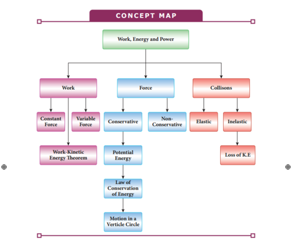
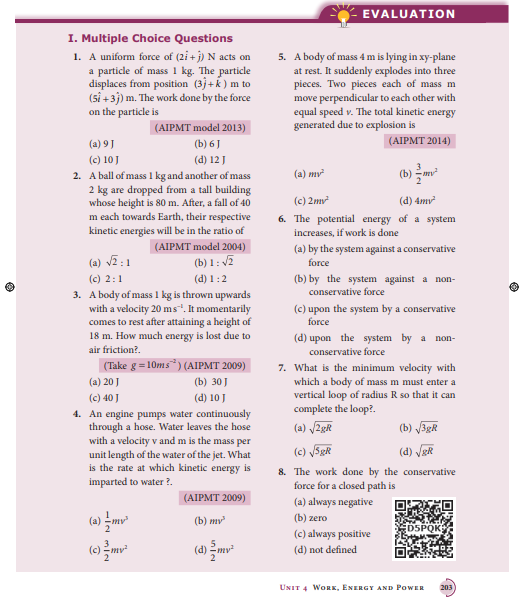
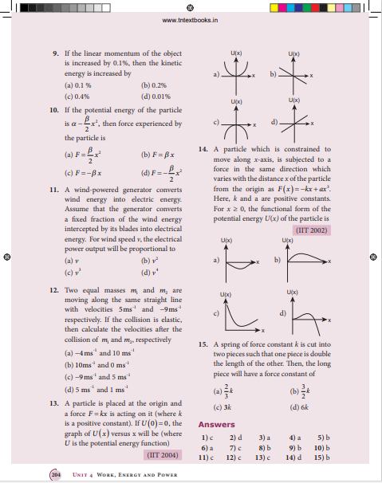
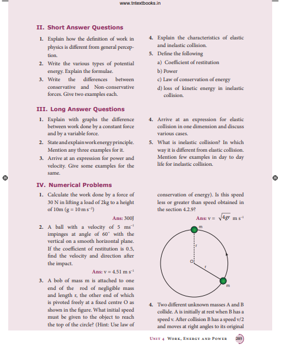
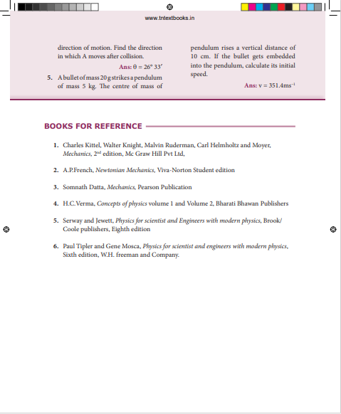
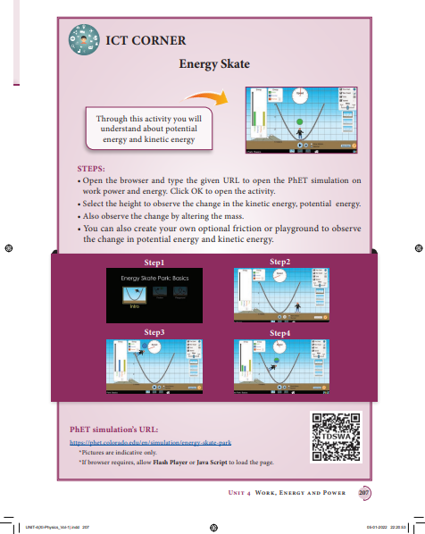

[comment]: <> (katex Header)


# SUMMARY

1. When a force $$\vec{F}$$ acting on an object displaces it by $$\vec{dr}$$, then the work done ($$W$$) by the force is given by $$W = \int \vec{F} \cdot d\vec{r} = \int F dr \cos \theta$$.

2. The work done by the variable force is defined as $$\int F dr$$.

3. Work-Kinetic Energy Theorem: The work done by a force on an object is equal to the change in its kinetic energy.

4. The kinetic energy can also be defined in terms of momentum, which is given by $$KE = \frac{p^2}{2m}$$.

5. The potential energy at a point $$P$$ is defined as the amount of work required to move the object from some reference point $$O$$ to point $$P$$ with constant velocity. It is given by $$U = \int \vec{F} \cdot d\vec{r}_\text{ext} = \int F dr$$. The reference point can be taken as zero potential energy.

6. The gravitational potential energy at height $$h$$ is given by $$U = mgh$$. When the elongation or compression is $$x$$, the spring potential energy is given by $$U = \frac{1}{2}kx^2$$, where $$k$$ is the spring constant.

7. The work done by a conservative force around a closed path is zero, and for a non-conservative force, it is not zero.

8. The gravitational force, spring force, and Coulomb force are all conservative, but frictional force is non-conservative.

9. In a conservative force field, the total energy of the object is conserved.

10. In vertical circular motion, the minimum speed required by the mass to complete the circle is $$5gr$$, where $$r$$ is the radius of the circle.

11. Power is defined as the rate of work done or energy delivered. It is equal to $$P = \frac{W}{t} = \vec{F} \cdot \vec{v}$$.

12. The total linear momentum of the system is always conserved for both elastic and inelastic collisions.

13. The kinetic energy of the system is conserved in elastic collisions.

14. The coefficient of restitution is defined as the velocity of separation (after collision) divided by the velocity of approach (before collision).

